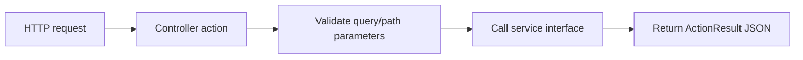

# Controllers

## Purpose

The `Controllers` folder contains ASP.NET Core MVC controllers. Controllers define the public HTTP API surface consumed by the React dashboard.

Controllers should stay thin. Their job is to:

- Define routes.
- Validate simple request parameters.
- Call a service interface.
- Return HTTP responses.

Database query logic belongs in `Services/`, not in controllers.

## Request Pattern



## Controllers

| File | Route prefix | What it does |
| --- | --- | --- |
| `DashboardController.cs` | `api/dashboard` | Returns dashboard summary cards. |
| `CapacityController.cs` | `api/capacity` | Returns database capacity rows, trend rows, and top growing tables. |
| `AlertsController.cs` | `api/alerts` | Returns active/history repository alerts, alert work notes, and deletes selected alert rows. |
| `ServersController.cs` | `api/servers` | Returns active server inventory. |
| `SettingsController.cs` | `api/settings` | Returns, updates, and resets alert threshold settings. |
| `ApplicationCmdbController.cs` | `api/cmdb` | Returns, imports, updates, and deletes application CMDB mappings. |
| `CollectorRunController.cs` | `api/collector-run` | Queues and polls the Azure DevOps collector pipeline. |

## DashboardController

Endpoint:

```text
GET /api/dashboard/summary
```

Returns:

```text
DashboardSummary
```

Used by the dashboard summary card grid. The controller delegates to `IDashboardService.GetSummaryAsync`.

## CapacityController

Endpoints:

```text
GET /api/capacity/databases
GET /api/capacity/databases/{serverName}/{databaseName}/trend?days=90
GET /api/capacity/top-growing-tables?limit=20
```

### Database Capacity Endpoint

Optional query parameters:

| Query parameter | Purpose |
| --- | --- |
| `riskLevel` | Filter by `All`, `Healthy`, `Low`, `Medium`, `High`, or `Critical`. |
| `serverName` | Filter to one server. |
| `databaseName` | Contains-style database search. |

The controller validates `riskLevel` and returns `400 Bad Request` if an invalid risk value is supplied.

### Trend Endpoint

Path parameters:

| Parameter | Purpose |
| --- | --- |
| `serverName` | Source server name. |
| `databaseName` | Database name. |

Query parameter:

| Parameter | Purpose |
| --- | --- |
| `days` | Number of history days to return. Must be greater than zero. |

### Top Growing Tables Endpoint

Query parameter:

| Parameter | Purpose |
| --- | --- |
| `limit` | Maximum row count to return. Must be greater than zero. |

## AlertsController

Endpoint:

```text
GET /api/alerts/active
DELETE /api/alerts/{alertId}
```

Returns active unresolved alerts from `dbo.vw_ActiveAlerts`. The history endpoint returns resolved alerts from `dbo.AlertHistory`.

Work-note endpoints:

```text
GET  /api/alerts/{alertId}/work-notes
POST /api/alerts/{alertId}/work-notes
```

`GET` returns the alert timeline from `dbo.AlertWorkNote`. `POST` appends a dashboard `UserComment` note. Auto-heal system notes are written by the auto-heal API and collector.

The delete endpoint removes one row from `dbo.AlertHistory`; if the underlying issue is still active, a later collector run can raise a fresh alert. Work notes cascade with the deleted alert row.

## ServersController

Endpoint:

```text
GET /api/servers
```

Returns active inventory rows from `dbo.ServerInventory`. Useful for future filters and operational views.

## SettingsController

Endpoints:

```text
GET /api/settings/alert-thresholds
PUT /api/settings/alert-thresholds/{settingId}
POST /api/settings/alert-thresholds/{settingId}/reset
```

Returns threshold rows from `dbo.AlertThresholdSetting`. The update action validates the requested value against the row's `minimum_value_decimal` and `maximum_value_decimal`. The reset action restores `setting_value_decimal` from `default_value_decimal`.

## ApplicationCmdbController

Endpoints:

```text
GET /api/cmdb/applications
GET /api/cmdb/database?serverName=x&databaseName=y
PUT /api/cmdb/applications
POST /api/cmdb/applications/import
DELETE /api/cmdb/database-mappings/{mappingId}
DELETE /api/cmdb/applications/{applicationId}
```

This controller backs the CMDB page, the dashboard database-name right-click editor, and alert email CC lookup. It validates required application names and database mapping pairs before calling `IApplicationCmdbService`.

## CollectorRunController

Endpoints:

```text
GET /api/collector-run
POST /api/collector-run
```

`POST` queues the configured `DBA Capacity - Collect Metrics` pipeline through `ICollectorRunService`. `GET` returns the latest tracked Azure DevOps run status so the dashboard can keep the Run collector button disabled while the pipeline is active.

This controller intentionally keeps Azure DevOps credentials server-side. The frontend only sees run status, result, elapsed timing fields, and the optional Azure DevOps web link.

## Adding A New Controller Endpoint

1. Add or update a model in `Models/`.
2. Add a method to the matching service interface in `Services/`.
3. Implement the SQL query in the service class.
4. Add the controller action.
5. Add response type attributes for Swagger.
6. Test in `/swagger`.
7. Update the frontend API client if the web app needs the endpoint.

Example controller pattern:

```csharp
[HttpGet("example")]
[ProducesResponseType(typeof(IReadOnlyList<ExampleItem>), StatusCodes.Status200OK)]
public async Task<ActionResult<IReadOnlyList<ExampleItem>>> GetExample(CancellationToken cancellationToken)
{
    var rows = await exampleService.GetExampleAsync(cancellationToken);
    return Ok(rows);
}
```

## Customer Lift-And-Shift Notes

Controllers usually do not need customer-specific changes. Customer changes normally happen in:

- `appsettings.Production.json`
- Azure DevOps variables
- SQL views/procedures
- IIS bindings

Change controllers only when adding a new API capability.

## Troubleshooting

| Symptom | Likely controller-level cause | Fix |
| --- | --- | --- |
| `400 Bad Request` | Invalid query parameter, such as unsupported risk level. | Check request URL and allowed values. |
| Endpoint missing from Swagger | Controller route/action missing or app not redeployed. | Rebuild and redeploy API. |
| Endpoint returns empty array | Service query found no rows. | Validate repository views directly in SQL Server. |
