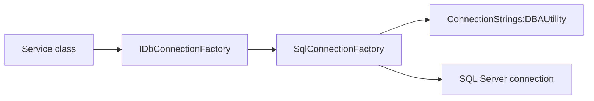

# Data

## Purpose

The `Data` folder owns the API database connection abstraction. It keeps SQL connection creation in one place so services do not need to know how configuration is loaded.

## Files

| File | Purpose |
| --- | --- |
| `IDbConnectionFactory.cs` | Interface used by services to request an open database connection. |
| `SqlConnectionFactory.cs` | Implementation that reads `ConnectionStrings:DBAUtility` and opens a SQL Server connection. |

## How It Works



## IDbConnectionFactory

Interface:

```csharp
Task<IDbConnection> CreateOpenConnectionAsync(CancellationToken cancellationToken = default);
```

The returned connection is already open. Service classes use it inside `using var` so it is disposed after the query finishes.

## SqlConnectionFactory

`SqlConnectionFactory` reads:

```text
ConnectionStrings:DBAUtility
```

If the connection string is missing, it throws:

```text
Connection string 'DBAUtility' is not configured.
```

It creates a `Microsoft.Data.SqlClient.SqlConnection` and opens it asynchronously.

## Configuration Sources

Local development:

```text
api/DBA.Capacity.Api/appsettings.json
```

IIS production:

```text
appsettings.Production.json
```

Pipeline variable used to generate production settings:

```text
DBA_API_CONNECTION_STRING
```

## Example Connection Strings

Windows authentication:

```text
Server=.;Database=DBAUtility;Trusted_Connection=True;TrustServerCertificate=True;
```

SQL authentication:

```text
Server=customer-sqlrepo-01;Database=DBAUtility;User ID=dba_api_reader;Password=<secret>;TrustServerCertificate=True;
```

## Customer Lift-And-Shift Notes

For customer deployments:

1. Decide whether the API uses Windows authentication or SQL authentication.
2. If using Windows authentication, grant the IIS app pool identity read access to `DBAUtility`.
3. If using SQL authentication, set `DBA_API_CONNECTION_STRING` as a secret variable.
4. Validate the API can call `/api/dashboard/summary`.

## Troubleshooting

| Symptom | Likely cause | Fix |
| --- | --- | --- |
| Missing connection string error | `DBA_API_CONNECTION_STRING` or appsettings value missing. | Add the connection string and redeploy API. |
| Login failed for app pool identity | SQL Server does not have a login/user for the app pool. | Grant `IIS APPPOOL\DBACapacityApi` read access. |
| Certificate error | SQL encryption certificate is not trusted. | Use a trusted cert or include `TrustServerCertificate=True` for MVP/local deployments. |

