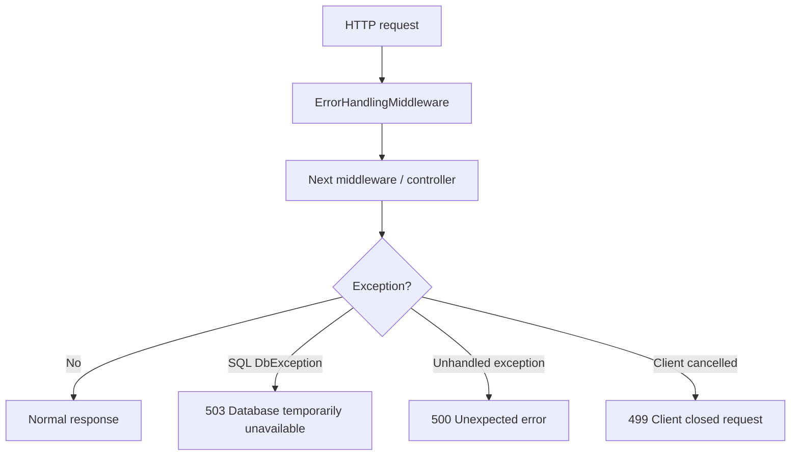

# Middleware

## Purpose

The `Middleware` folder contains API request pipeline middleware. Middleware runs around controller execution and handles cross-cutting concerns.

The current middleware provides centralized error handling.

## File

| File | Purpose |
| --- | --- |
| `ErrorHandlingMiddleware.cs` | Converts unhandled exceptions and SQL exceptions into consistent JSON problem responses. |

## How It Works



## ErrorHandlingMiddleware

This middleware catches:

| Exception type | Response |
| --- | --- |
| `OperationCanceledException` where request was aborted | HTTP 499 |
| `DbException` | HTTP 503 with title `Database temporarily unavailable.` |
| Other `Exception` | HTTP 500 with title `An unexpected error occurred.` |

For database and unhandled exceptions, the middleware logs the full exception server-side but returns a safe, simple response to the client.

## Response Shape

The middleware returns `application/problem+json`.

Example:

```json
{
  "status": 503,
  "title": "Database temporarily unavailable."
}
```

## Why This Exists

Without this middleware, unhandled SQL or runtime exceptions could leak implementation details to the browser. This middleware keeps responses consistent and makes frontend error handling simple.

## Customer Lift-And-Shift Notes

Customer deployments usually do not need to change middleware. Consider extending it if the customer requires:

- Correlation IDs
- Structured error codes
- Application Insights integration
- Custom audit logging
- Different problem response format

## Troubleshooting

| Symptom | Meaning | Next step |
| --- | --- | --- |
| `Database temporarily unavailable.` | SQL connection/query threw `DbException`. | Check SQL Server connectivity, credentials, and app pool permissions. |
| `An unexpected error occurred.` | Non-SQL unhandled exception. | Check IIS/API logs. |
| Browser receives 499 | Client cancelled request or navigated away. | Usually harmless unless frequent. |

