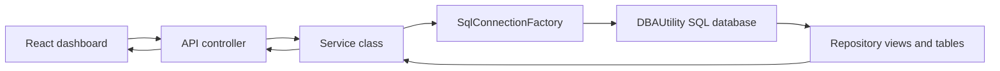

# DBA.Capacity.Api

## Purpose

`DBA.Capacity.Api` is the ASP.NET Core API for the DBA Capacity Intelligence Dashboard. It is the server-side boundary between the React dashboard, the `DBAUtility` SQL Server repository, and controlled operational actions such as queueing the collector pipeline.

The API does not collect metrics and does not connect to monitored source servers. It reads the already-collected repository data, returns JSON to the web app, supports deleting selected alert rows from `dbo.AlertHistory`, and can trigger the Azure DevOps collector pipeline using server-side credentials.

## How The API Works



## Startup File

The entry point is:

```text
Program.cs
```

`Program.cs` configures:

- Controllers
- Swagger
- CORS policy named `DashboardFrontend`
- Dapper underscore mapping
- SQL connection factory
- Feature services
- Error handling middleware
- `/health`
- `/swagger`
- root redirect to Swagger

## Component Folders

| Folder | What it contains |
| --- | --- |
| `Controllers/` | HTTP endpoint classes. Controllers validate simple request parameters and call services. |
| `Services/` | Business/query layer. Services run SQL against repository views and tables using Dapper. |
| `Data/` | SQL connection factory abstraction and implementation. |
| `Middleware/` | Cross-cutting HTTP middleware, currently centralized error handling. |
| `Models/` | Response DTOs returned by API endpoints. |
| `Properties/` | Local launch profile settings for development. |

## API Endpoints

| Endpoint | Controller | Purpose |
| --- | --- | --- |
| `GET /health` | `Program.cs` | Basic runtime health response. |
| `GET /swagger` | Swagger | Interactive endpoint documentation. |
| `GET /api/dashboard/summary` | `DashboardController` | Summary cards on dashboard. |
| `GET /api/capacity/databases` | `CapacityController` | Main database capacity table. |
| `GET /api/capacity/databases/{serverName}/{databaseName}/trend?days=90` | `CapacityController` | Database size trend chart. |
| `GET /api/capacity/top-growing-tables?limit=20` | `CapacityController` | Top growing tables page. |
| `GET /api/alerts/active` | `AlertsController` | Active alerts page. |
| `DELETE /api/alerts/{alertId}` | `AlertsController` | Deletes one alert row from `dbo.AlertHistory`. |
| `GET /api/servers` | `ServersController` | Active server inventory. |
| `GET /api/settings/alert-thresholds` | `SettingsController` | Returns editable forecast and alert threshold settings. |
| `PUT /api/settings/alert-thresholds/{settingId}` | `SettingsController` | Updates one threshold value after min/max validation. |
| `POST /api/settings/alert-thresholds/{settingId}/reset` | `SettingsController` | Resets one threshold to its repository default value. |
| `GET /api/cmdb/applications` | `ApplicationCmdbController` | Returns application CMDB rows and database mappings. |
| `GET /api/cmdb/database?serverName=x&databaseName=y` | `ApplicationCmdbController` | Returns the mapped application/contact row for one database. |
| `PUT /api/cmdb/applications` | `ApplicationCmdbController` | Creates or updates an application and optionally maps it to a database. |
| `POST /api/cmdb/applications/import` | `ApplicationCmdbController` | Bulk imports CMDB rows from parsed CSV data. |
| `DELETE /api/cmdb/database-mappings/{mappingId}` | `ApplicationCmdbController` | Removes one database-to-application mapping. |
| `DELETE /api/cmdb/applications/{applicationId}` | `ApplicationCmdbController` | Deletes one application and its database mappings. |
| `GET /api/collector-run` | `CollectorRunController` | Latest Azure DevOps collector pipeline run status tracked by this API instance. |
| `POST /api/collector-run` | `CollectorRunController` | Queues `DBA Capacity - Collect Metrics` through Azure DevOps. |
| `POST /api/auto-heal/requests` | `AutoHealController` | Queues an auto-heal pipeline action and creates a durable request row. |
| `GET /api/auto-heal/requests/{requestId}` | `AutoHealController` | Returns auto-heal request status, pipeline link, details JSON, and discovered file candidates. |
| `POST /api/auto-heal/requests/{requestId}/cleanup-files` | `AutoHealController` | Marks selected `.bak`/`.trn` files and queues selected-file cleanup. |

Capacity and summary endpoints support environment filtering from `dbo.ServerInventory.environment`:

```text
GET /api/dashboard/summary?environment=Production
GET /api/capacity/databases?environment=Production
GET /api/capacity/top-growing-tables?limit=500&environment=Production
```

Valid environment labels come from the onboard pipeline: `Development`, `Test`, `QA`, `UAT`, `Production`, and `DR`.

The active alerts response includes drill-through fields used by the web popup:

| Field | Meaning |
| --- | --- |
| `alertId` | Stable alert row identifier. |
| `environment` | Server environment from `dbo.ServerInventory`. |
| `sourceScript` | Script or procedure chain that produced the alert. |
| `detailsJson` | Structured evidence stored by the collector or `dbo.usp_GenerateAlerts`. |

For alerts created before evidence fields existed, the API returns a legacy fallback JSON object so the web popup can still show the likely source script and a note to rerun collection for full metric-specific evidence.

## Alert Threshold Settings

Settings endpoints read and update `dbo.AlertThresholdSetting`. They are used by the dashboard Settings page at `#/settings`.

`PUT /api/settings/alert-thresholds/{settingId}` accepts:

```json
{
  "settingValueDecimal": 30
}
```

The API checks the row's configured minimum and maximum values before saving. Reset uses `default_value_decimal`. Stored procedures pick up the saved values during the next collector/forecast run.

## Application CMDB

CMDB endpoints read and update:

```text
dbo.ApplicationCmdb
dbo.ApplicationDatabaseMapping
```

Ownership is application-centered. `PUT /api/cmdb/applications` can create/update an application and map it to a database in one call. If the request uses an existing `applicationName` without `applicationId`, the API reuses that application so multiple databases can map to the same application.

Alert More info calls `GET /api/cmdb/database` for the alert database. The web app keeps `To` blank and places configured CMDB email fields in `CC`.

## Configuration

The API reads its repository connection string from:

```text
ConnectionStrings:DBAUtility
```

Local default:

```json
"ConnectionStrings": {
  "DBAUtility": "Server=.;Database=DBAUtility;Trusted_Connection=True;TrustServerCertificate=True;"
}
```

The API reads allowed frontend origins from:

```text
Cors:AllowedOrigins
```

In IIS deployment, the pipeline can write these values into `appsettings.Production.json` from Azure DevOps variables:

| Variable | Purpose |
| --- | --- |
| `DBA_API_CONNECTION_STRING` | Production SQL connection string for `DBAUtility`. |
| `DBA_API_ALLOWED_ORIGINS` | Semicolon-separated dashboard browser origins allowed by CORS. Use the dashboard server name or DNS alias. |
| `AZDO_ORGANIZATION` | Azure DevOps organization name, for example `kaz-tec`. |
| `AZDO_PROJECT` | Azure DevOps project name, for example `PersonalEnvironment`. |
| `AZDO_COLLECTOR_PIPELINE_ID` | Optional numeric pipeline id for `DBA Capacity - Collect Metrics`. |
| `AZDO_COLLECTOR_PIPELINE_NAME` | Pipeline name fallback when the numeric id is not configured. |
| `AZDO_AUTOHEAL_PIPELINE_ID` | Optional numeric pipeline id for `DBA Capacity - Auto Heal`. |
| `AZDO_AUTOHEAL_PIPELINE_NAME` | Pipeline name fallback when the numeric id is not configured. |
| `AZDO_PAT` | Secret PAT used by the API to queue and read pipeline runs. |

Example customer CORS values:

```text
DBA_API_ALLOWED_ORIGINS = https://dba-capacity.contoso.local
DBA_API_ALLOWED_ORIGINS = http://dba-capacity-web
DBA_API_ALLOWED_ORIGINS = http://dba-capacity-web:8080
```

Only include `:port` when the dashboard uses a non-standard port. Do not use the API URL here; CORS must match the dashboard URL that appears in the user's browser.

## Collector Pipeline Trigger

The dashboard Run collector button calls:

```text
POST /api/collector-run
```

The API then calls Azure DevOps from the IIS server. Dashboard users do not need Azure DevOps pipeline permissions and the PAT is never sent to the browser.

## Auto-Heal Pipeline Trigger

Alert More info uses `AutoHealController` to queue `DBA Capacity - Auto Heal` through the same server-side Azure DevOps PAT used by the collector trigger.

Supported actions:

| Action | What it does |
| --- | --- |
| `BackupRetentionScan` | Scans the supplied alert volume/path, deletes only `.bak` and `.trn` files older than 90 days, and writes remaining file candidates to `dbo.AutoHealFileCandidate`. |
| `DeleteSelectedBackupFiles` | Deletes only file paths that the dashboard user selected from the prior scan result. |
| `LogShrinkAssessment` | Checks open transactions, used log percent, log size, and log reuse wait before attempting a one-time shrink of inflated log files. |

The API stores request state in `dbo.AutoHealRequest`. The dashboard polls the API and never calls Azure DevOps directly.

Required configuration:

```json
"AzureDevOps": {
  "Organization": "kaz-tec",
  "Project": "PersonalEnvironment",
  "CollectorPipelineId": "123",
  "CollectorPipelineName": "DBA Capacity - Collect Metrics",
  "Pat": "secret"
}
```

`CollectorPipelineId` is preferred. If it is blank, the API lists pipelines in the project and finds one named `CollectorPipelineName`.

The API keeps the latest triggered run id in memory. While the run is active, the dashboard polls `GET /api/collector-run`; the button becomes clickable again when Azure DevOps reports the run state as `completed`.

## IIS Deployment

The API is deployed by:

```text
pipelines/deploy-api.yml
```

Default IIS values:

```text
Site: DBA Capacity API
App pool: DBACapacityApi
Physical path: C:\inetpub\dba-capacity-api
URL: http://localhost:5088
```

The IIS host must have the ASP.NET Core Hosting Bundle installed.

## Database Access

The API should have read repository access plus narrow permissions for dashboard actions. The default IIS deployment grants:

```text
IIS APPPOOL\DBACapacityApi -> db_datareader on DBAUtility
IIS APPPOOL\DBACapacityApi -> DELETE on dbo.AlertHistory
IIS APPPOOL\DBACapacityApi -> UPDATE on dbo.AlertThresholdSetting
IIS APPPOOL\DBACapacityApi -> INSERT/UPDATE/DELETE on dbo.ApplicationCmdb
IIS APPPOOL\DBACapacityApi -> INSERT/UPDATE/DELETE on dbo.ApplicationDatabaseMapping
```

If using SQL authentication instead, set `DBA_API_CONNECTION_STRING` to a SQL login with equivalent permissions.

## Local Development

```powershell
dotnet run --project .\api\DBA.Capacity.Api\DBA.Capacity.Api.csproj --launch-profile http
```

Open:

```text
http://localhost:5088/swagger
```

Health check:

```text
http://localhost:5088/health
```

## Common Changes

| Change | Where to edit |
| --- | --- |
| Add a new endpoint | Add a controller action and service method. |
| Add a new dashboard field | Add SQL in service, update model DTO, update frontend model usage. |
| Change CORS | Update `Cors:AllowedOrigins` or `DBA_API_ALLOWED_ORIGINS`. |
| Change SQL source | Update `ConnectionStrings:DBAUtility` or `DBA_API_CONNECTION_STRING`. |
| Change collector trigger pipeline | Update `AZDO_COLLECTOR_PIPELINE_ID` or `AZDO_COLLECTOR_PIPELINE_NAME`, then redeploy API. |
| Add authentication | Configure auth in `Program.cs`, then decorate controllers or policies. |

## Troubleshooting

| Symptom | Likely cause | Fix |
| --- | --- | --- |
| `/health` works but dashboard data fails | SQL connection or permission problem. | Check `DBA_API_CONNECTION_STRING` and database read access. |
| Browser CORS error | Web origin is not allowed. | Add web URL to `DBA_API_ALLOWED_ORIGINS` and redeploy API. |
| `/swagger` does not load on IIS | Hosting bundle or IIS deployment issue. | Install ASP.NET Core Hosting Bundle and redeploy. |
| API returns `Database temporarily unavailable` | SQL exception caught by middleware. | Check SQL Server availability, app pool identity, and connection string. |
| Run collector button says not configured | Missing Azure DevOps settings. | Add `AZDO_ORGANIZATION`, `AZDO_PROJECT`, `AZDO_PAT`, and either pipeline id or name to `configs`; redeploy API. |
| Run collector button says Azure DevOps rejected request | PAT, organization, project, or pipeline id is wrong. | Use an automation PAT with pipeline read/run permission and verify the pipeline URL. |
