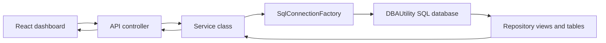

# DBA.Capacity.Api

## Purpose

`DBA.Capacity.Api` is the ASP.NET Core API for the DBA Capacity Intelligence Dashboard. It is the server-side boundary between the React dashboard and the `DBAUtility` SQL Server repository.

The API does not collect metrics and does not connect to monitored source servers. It reads the already-collected repository data, returns JSON to the web app, and supports deleting selected alert rows from `dbo.AlertHistory`.

## How The API Works



## Startup File

The entry point is:

```text
Program.cs
```

`Program.cs` configures:

- Controllers
- Swagger
- CORS policy named `DashboardFrontend`
- Dapper underscore mapping
- SQL connection factory
- Feature services
- Error handling middleware
- `/health`
- `/swagger`
- root redirect to Swagger

## Component Folders

| Folder | What it contains |
| --- | --- |
| `Controllers/` | HTTP endpoint classes. Controllers validate simple request parameters and call services. |
| `Services/` | Business/query layer. Services run SQL against repository views and tables using Dapper. |
| `Data/` | SQL connection factory abstraction and implementation. |
| `Middleware/` | Cross-cutting HTTP middleware, currently centralized error handling. |
| `Models/` | Response DTOs returned by API endpoints. |
| `Properties/` | Local launch profile settings for development. |

## API Endpoints

| Endpoint | Controller | Purpose |
| --- | --- | --- |
| `GET /health` | `Program.cs` | Basic runtime health response. |
| `GET /swagger` | Swagger | Interactive endpoint documentation. |
| `GET /api/dashboard/summary` | `DashboardController` | Summary cards on dashboard. |
| `GET /api/capacity/databases` | `CapacityController` | Main database capacity table. |
| `GET /api/capacity/databases/{serverName}/{databaseName}/trend?days=90` | `CapacityController` | Database size trend chart. |
| `GET /api/capacity/top-growing-tables?limit=20` | `CapacityController` | Top growing tables page. |
| `GET /api/alerts/active` | `AlertsController` | Active alerts page. |
| `DELETE /api/alerts/{alertId}` | `AlertsController` | Deletes one alert row from `dbo.AlertHistory`. |
| `GET /api/servers` | `ServersController` | Active server inventory. |

Capacity and summary endpoints support environment filtering from `dbo.ServerInventory.environment`:

```text
GET /api/dashboard/summary?environment=Production
GET /api/capacity/databases?environment=Production
GET /api/capacity/top-growing-tables?limit=500&environment=Production
```

Valid environment labels come from the onboard pipeline: `Development`, `Test`, `QA`, `UAT`, `Production`, and `DR`.

The active alerts response includes drill-through fields used by the web popup:

| Field | Meaning |
| --- | --- |
| `alertId` | Stable alert row identifier. |
| `environment` | Server environment from `dbo.ServerInventory`. |
| `sourceScript` | Script or procedure chain that produced the alert. |
| `detailsJson` | Structured evidence stored by the collector or `dbo.usp_GenerateAlerts`. |

For alerts created before evidence fields existed, the API returns a legacy fallback JSON object so the web popup can still show the likely source script and a note to rerun collection for full metric-specific evidence.

## Configuration

The API reads its repository connection string from:

```text
ConnectionStrings:DBAUtility
```

Local default:

```json
"ConnectionStrings": {
  "DBAUtility": "Server=.;Database=DBAUtility;Trusted_Connection=True;TrustServerCertificate=True;"
}
```

The API reads allowed frontend origins from:

```text
Cors:AllowedOrigins
```

In IIS deployment, the pipeline can write these values into `appsettings.Production.json` from Azure DevOps variables:

| Variable | Purpose |
| --- | --- |
| `DBA_API_CONNECTION_STRING` | Production SQL connection string for `DBAUtility`. |
| `DBA_API_ALLOWED_ORIGINS` | Semicolon-separated list of dashboard URLs allowed by CORS. |

## IIS Deployment

The API is deployed by:

```text
pipelines/deploy-api.yml
```

Default IIS values:

```text
Site: DBA Capacity API
App pool: DBACapacityApi
Physical path: C:\inetpub\dba-capacity-api
URL: http://localhost:5088
```

The IIS host must have the ASP.NET Core Hosting Bundle installed.

## Database Access

The API should have read repository access plus the narrow alert-cleanup permission. The default IIS deployment grants:

```text
IIS APPPOOL\DBACapacityApi -> db_datareader on DBAUtility
IIS APPPOOL\DBACapacityApi -> DELETE on dbo.AlertHistory
```

If using SQL authentication instead, set `DBA_API_CONNECTION_STRING` to a SQL login with equivalent permissions.

## Local Development

```powershell
dotnet run --project .\api\DBA.Capacity.Api\DBA.Capacity.Api.csproj --launch-profile http
```

Open:

```text
http://localhost:5088/swagger
```

Health check:

```text
http://localhost:5088/health
```

## Common Changes

| Change | Where to edit |
| --- | --- |
| Add a new endpoint | Add a controller action and service method. |
| Add a new dashboard field | Add SQL in service, update model DTO, update frontend model usage. |
| Change CORS | Update `Cors:AllowedOrigins` or `DBA_API_ALLOWED_ORIGINS`. |
| Change SQL source | Update `ConnectionStrings:DBAUtility` or `DBA_API_CONNECTION_STRING`. |
| Add authentication | Configure auth in `Program.cs`, then decorate controllers or policies. |

## Troubleshooting

| Symptom | Likely cause | Fix |
| --- | --- | --- |
| `/health` works but dashboard data fails | SQL connection or permission problem. | Check `DBA_API_CONNECTION_STRING` and database read access. |
| Browser CORS error | Web origin is not allowed. | Add web URL to `DBA_API_ALLOWED_ORIGINS` and redeploy API. |
| `/swagger` does not load on IIS | Hosting bundle or IIS deployment issue. | Install ASP.NET Core Hosting Bundle and redeploy. |
| API returns `Database temporarily unavailable` | SQL exception caught by middleware. | Check SQL Server availability, app pool identity, and connection string. |
