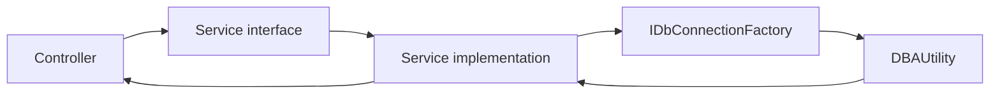

# Services

## Purpose

The `Services` folder contains the API query layer. Controllers call service interfaces, and services query the `DBAUtility` repository using Dapper.

Services are where SQL queries live.

## Service Pattern



## Service Inventory

| Interface | Implementation | Purpose |
| --- | --- | --- |
| `IDashboardService` | `DashboardService` | Summary card values. |
| `ICapacityService` | `CapacityService` | Database dashboard rows, trend rows, and top growing tables. |
| `IAlertService` | `AlertService` | Active alert queue. |
| `IServerService` | `ServerService` | Active server inventory. |
| `ISettingsService` | `SettingsService` | Editable alert threshold settings. |
| `ICollectorRunService` | `AzureDevOpsCollectorRunService` | Queues and polls the Azure DevOps collector pipeline. |

## DashboardService

Method:

```csharp
Task<DashboardSummary> GetSummaryAsync(CancellationToken cancellationToken);
```

Reads:

- `dbo.ServerInventory`
- `dbo.vw_LatestCapacityDashboard`
- `dbo.vw_ActiveAlerts`

Returns:

- Total active servers
- Total databases
- Critical alert count
- High-risk database count
- Largest database
- Fastest growing database

The service uses `QueryMultipleAsync` because all summary values can be retrieved in one SQL round trip.

## CapacityService

Methods:

```csharp
Task<IReadOnlyList<CapacityDashboardItem>> GetLatestDatabasesAsync(...);
Task<IReadOnlyList<DatabaseTrendPoint>> GetDatabaseTrendAsync(...);
Task<IReadOnlyList<TopGrowingTableItem>> GetTopGrowingTablesAsync(...);
```

Reads:

- `dbo.vw_LatestCapacityDashboard`
- `dbo.vw_DatabaseSizeTrend`
- `dbo.vw_TopGrowingTables`

Important behavior:

- `riskLevel = All` means no risk filter.
- `databaseName` uses a `LIKE` filter.
- Trend `days` is clamped between `1` and `3650`.
- Top growing tables `limit` is clamped between `1` and `500`.

## AlertService

Method:

```csharp
Task<IReadOnlyList<AlertItem>> GetActiveAlertsAsync(CancellationToken cancellationToken);
```

Reads:

```text
dbo.vw_ActiveAlerts
```

Sort order:

1. Critical
2. High
3. Medium
4. Low
5. Everything else
6. Newest alert time first

## ServerService

Method:

```csharp
Task<IReadOnlyList<ServerInventoryItem>> GetActiveServersAsync(CancellationToken cancellationToken);
```

Reads:

```text
dbo.ServerInventory
```

Filters:

```sql
WHERE is_active = 1
```

Sorts by:

```text
environment, server_name
```

## SettingsService

Methods:

```csharp
Task<IReadOnlyList<AlertThresholdSettingItem>> GetAlertThresholdsAsync(...);
Task<AlertThresholdSettingItem?> GetAlertThresholdAsync(...);
Task<AlertThresholdSettingItem?> UpdateAlertThresholdAsync(...);
Task<AlertThresholdSettingItem?> ResetAlertThresholdAsync(...);
```

Reads and updates:

```text
dbo.AlertThresholdSetting
```

The service exposes the threshold metadata needed by the Settings page: alert type, setting key, display label, unit, current value, default value, validation range, and last update metadata.

## AzureDevOpsCollectorRunService

Methods:

```csharp
Task<CollectorRunStatus> GetLatestStatusAsync(...);
Task<CollectorRunStatus> QueueRunAsync(...);
```

Purpose:

- Reads Azure DevOps configuration from `AzureDevOps:*` settings or `AZDO_*` environment variables.
- Queues `DBA Capacity - Collect Metrics` through Azure DevOps REST APIs.
- Uses `CollectorRunState` to remember the latest run id for this API process.
- Returns readable status messages when configuration, PAT, organization, project, or pipeline lookup fails.

Security behavior:

- The React app never receives the PAT.
- The IIS API process performs the Azure DevOps call.
- Dashboard users only need access to the dashboard; the service PAT owns the pipeline permission boundary.

## SQL Safety

Services use Dapper parameters for user-supplied values.

Examples:

- `@RiskLevel`
- `@ServerName`
- `@DatabaseName`
- `@Days`
- `@Limit`

Do not concatenate user input directly into SQL. The only dynamic SQL in the current services is the optional `WHERE` clause structure, while values are still parameterized.

## Adding A New Service Method

1. Add a DTO in `Models/`.
2. Add a method to the service interface.
3. Implement the method in the service class.
4. Use `IDbConnectionFactory.CreateOpenConnectionAsync`.
5. Use `CommandDefinition` and pass `cancellationToken`.
6. Return `rows.AsList()` for query lists.
7. Add or update a controller endpoint.
8. Validate with Swagger.

## Customer Lift-And-Shift Notes

Customer-specific reporting usually starts here. Prefer adding a repository view first, then query that view from a service.

Recommended pattern:

1. Create a SQL view under `database/views`.
2. Add a model under `Models`.
3. Add a service method.
4. Add a controller endpoint.
5. Add frontend UI if needed.

## Troubleshooting

| Symptom | Likely cause | Fix |
| --- | --- | --- |
| Endpoint returns empty list | Repository view has no rows. | Query the view directly in SQL Server. |
| Endpoint returns 503 | SQL exception from service query. | Check SQL permissions and view/procedure deployment. |
| Sorting differs from UI | SQL service and frontend both sort. | Decide whether server or frontend owns final ordering. |
| New field is null | SQL alias does not match DTO property. | Add explicit `AS PropertyName` alias. |
