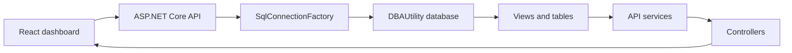

# API

## Purpose

The `api` folder contains the ASP.NET Core service that exposes the `DBAUtility` repository to the React dashboard. The API is the only server-side component called by browsers. It reads capacity, forecast, alert, and inventory data from SQL Server, and it can delete selected alert rows from `dbo.AlertHistory`.

The frontend never receives SQL credentials and never connects directly to SQL Server.

## Project Location

```text
api/DBA.Capacity.Api/
```

## Runtime Stack

| Area | Technology |
| --- | --- |
| Framework | ASP.NET Core |
| Language | C# |
| SQL access | Dapper |
| Database driver | Microsoft.Data.SqlClient |
| Documentation | Swagger |
| Hosting target | IIS with ASP.NET Core Hosting Bundle |
| Pipeline | `pipelines/deploy-api.yml` |

## Request Flow



## Important Files

| File or folder | Description |
| --- | --- |
| `Program.cs` | Registers controllers, Swagger, CORS, services, middleware, health endpoint, and root redirect. |
| `appsettings.json` | Local API connection string and CORS defaults. |
| `Controllers/` | HTTP endpoints grouped by feature. |
| `Services/` | Query logic and transformation logic. |
| `Models/` | Response DTOs returned to the frontend. |
| `Data/SqlConnectionFactory.cs` | Creates SQL Server connections from configuration. |
| `Middleware/ErrorHandlingMiddleware.cs` | Converts unexpected exceptions into friendly API errors. |

## Controllers And Endpoints

| Controller | Endpoint | Purpose |
| --- | --- | --- |
| `DashboardController` | `GET /api/dashboard/summary` | Summary cards for total servers, databases, alerts, and growth highlights. |
| `CapacityController` | `GET /api/capacity/databases` | Latest capacity dashboard rows with optional filters. |
| `CapacityController` | `GET /api/capacity/databases/{serverName}/{databaseName}/trend?days=90` | Trend chart data for a single database. |
| `CapacityController` | `GET /api/capacity/top-growing-tables?limit=20` | Top table growth rows. |
| `AlertsController` | `GET /api/alerts/active` | Active unresolved alert queue. |
| `AlertsController` | `DELETE /api/alerts/{alertId}` | Deletes one alert row from `dbo.AlertHistory`. |
| `ServersController` | `GET /api/servers` | Active server inventory. |
| `Program.cs` | `GET /health` | Health endpoint used after deployment. |
| `Program.cs` | `GET /swagger` | Swagger UI. |

## Configuration

The API reads configuration from appsettings files and environment-specific settings written by the pipeline.

Key configuration values:

```json
{
  "ConnectionStrings": {
    "DBAUtility": "Server=.;Database=DBAUtility;Trusted_Connection=True;TrustServerCertificate=True;"
  },
  "Cors": {
    "AllowedOrigins": [
      "http://localhost:8080"
    ]
  }
}
```

In pipeline deployments, `deploy-api.yml` can create `appsettings.Production.json` from these variable group values:

| Variable | Purpose |
| --- | --- |
| `DBA_API_CONNECTION_STRING` | SQL connection string used by the API. |
| `DBA_API_ALLOWED_ORIGINS` | Semicolon-separated list of frontend origins allowed by CORS. |
| `IIS_API_SITE_NAME` | IIS site name. |
| `IIS_API_APP_POOL` | IIS app pool name. |
| `IIS_API_PHYSICAL_PATH` | API deployment folder. |
| `IIS_API_PORT` | API HTTP port. |

## IIS Hosting

Default IIS values:

```text
Site: DBA Capacity API
App pool: DBACapacityApi
Path: C:\inetpub\dba-capacity-api
URL: http://localhost:5088
```

The app pool is configured with:

```text
managedRuntimeVersion = empty
identityType = ApplicationPoolIdentity
```

The empty runtime version is correct for ASP.NET Core because the ASP.NET Core Module launches the application.

## Database Permissions

The API should have read access plus the narrow alert-cleanup permission. The deployment pipeline attempts to grant:

```text
IIS APPPOOL\DBACapacityApi -> db_datareader on DBAUtility
IIS APPPOOL\DBACapacityApi -> DELETE on dbo.AlertHistory
```

If a customer uses SQL authentication instead, set `DBA_API_CONNECTION_STRING` to a SQL login with equivalent permissions.

Minimum API permission:

```sql
USE DBAUtility;
ALTER ROLE db_datareader ADD MEMBER [api_reader_or_app_pool_user];
GRANT DELETE ON dbo.AlertHistory TO [api_reader_or_app_pool_user];
```

## Local Run

```powershell
dotnet run --project .\api\DBA.Capacity.Api\DBA.Capacity.Api.csproj --launch-profile http
```

Validate:

```text
http://localhost:5088/health
http://localhost:5088/swagger
http://localhost:5088/api/dashboard/summary
```

## Pipeline Deployment

Pipeline:

```text
pipelines/deploy-api.yml
```

The pipeline:

1. Installs .NET SDK 9.
2. Restores NuGet packages.
3. Builds the API.
4. Runs test projects if any exist.
5. Publishes the API artifact.
6. Creates or updates the IIS site and app pool.
7. Copies published files with Robocopy.
8. Optionally grants database read access to the app pool.
9. Writes production settings if configured.

## Customer Lift-And-Shift Notes

For a customer environment:

1. Install ASP.NET Core Hosting Bundle on the IIS host.
2. Update API IIS variables in the `configs` variable group.
3. Update `DBA_API_CONNECTION_STRING` for the customer repository.
4. Update `DBA_API_ALLOWED_ORIGINS` to include the customer web URL.
5. Confirm the Azure DevOps agent service runs as a local administrator for IIS deployment.
6. Run `DBA Capacity - Deploy API`.
7. Validate `/health`, `/swagger`, and `/api/dashboard/summary`.

## Common Issues

| Symptom | Likely cause | Fix |
| --- | --- | --- |
| `Database temporarily unavailable` | API cannot connect to `DBAUtility`. | Check `DBA_API_CONNECTION_STRING` and SQL permissions. |
| Browser CORS error | Web origin is not in API CORS config. | Add web URL to `DBA_API_ALLOWED_ORIGINS` and redeploy API. |
| HTTP 500.19 | IIS hosting/module/config problem. | Install ASP.NET Core Hosting Bundle and review web.config generated by publish. |
| Deploy fails with administrator error | Agent service is not local admin. | Run Azure DevOps agent as a dedicated local admin account. |
