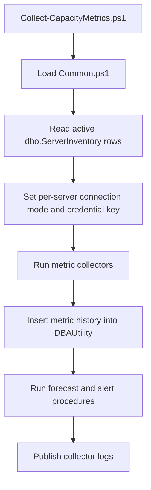

# Collector

## Purpose

The `collector` folder contains PowerShell automation that gathers capacity metrics from active SQL Server inventory rows and writes the results to the central `DBAUtility` repository.

The collector is designed to run from Azure DevOps on a self-hosted Windows agent, but it can also be run locally for troubleshooting.

Controlled remediation scripts live in `../autoheal`. Keep metric collection and auto-heal actions separate so collection can remain read-oriented while remediation remains explicitly requested from alert More info.

## Main Entry Point

```text
collector/Collect-CapacityMetrics.ps1
```

This script coordinates the complete collection cycle.

## Collection Flow



## Scripts

| Script | Role |
| --- | --- |
| `Common.ps1` | Shared functions for dbatools loading, repository connections, source credentials, SQL execution, and failure alert insertion. |
| `Collect-CapacityMetrics.ps1` | Orchestrates all metric collectors for active inventory rows. |
| `Collect-DatabaseSize.ps1` | Collects database size history. Azure SQL Database is handled per database using `sys.database_files`. |
| `Collect-FileSize.ps1` | Collects logical and physical file size details. |
| `Collect-DiskSpace.ps1` | Collects disk volume capacity using instance-level SQL Server metadata. Skipped for Azure SQL Database. |
| `Collect-TableSize.ps1` | Collects user table size and row count metrics. |
| `Collect-BackupSize.ps1` | Collects backup size history from `msdb`. Skipped for Azure SQL Database. |
| `Collect-TempDBUsage.ps1` | Collects aggregate TempDB usage and top session-level TempDB consumers. Skipped for Azure SQL Database. |
| `Collect-LongRunningTransactions.ps1` | Collects open transactions that have exceeded the configured duration threshold, including SQL text and cached XML query plan when available. Skipped for Azure SQL Database. |
| `Collect-BlockingSessions.ps1` | Collects blocking chains, lead blockers, blocked sessions, wait resources, likely blocked objects, lead blocker SQL text, blocked SQL text, cached XML query plans, and lead blocker held locks. Skipped for Azure SQL Database. |
| `Collect-AlwaysOnHealth.ps1` | Collects Always On dashboard-style replica and database health from HADR DMVs. Skips cleanly when Always On is not enabled. Skipped for Azure SQL Database. |
| `Collect-ReplicationHealth.ps1` | Collects replication database flags and replication agent status/errors from the local `distribution` database when present. Skipped for Azure SQL Database. |
| `Run-Forecast.ps1` | Executes forecast and alert generation stored procedures. |
| `config.example.json` | Example local environment settings. Do not store real passwords in this file. |

## Repository Connection

The collector connects to the central repository using these environment variables:

| Variable | Purpose |
| --- | --- |
| `DBA_REPOSITORY_SERVER` | SQL Server instance that hosts `DBAUtility`. |
| `DBA_REPOSITORY_DB` | Repository database name, usually `DBAUtility`. |
| `DBA_SQL_AUTH_MODE` | `SqlAuth` or `WindowsAuth` for the repository connection. |
| `SQL_USER` | Repository SQL login when `DBA_SQL_AUTH_MODE = SqlAuth`. |
| `SQL_PASSWORD` | Repository SQL password when `DBA_SQL_AUTH_MODE = SqlAuth`. |

For Windows authentication from an agent service to a local SQL Server, prefer:

```text
DBA_REPOSITORY_SERVER = .
```

## Source Server Credentials

Source credentials are chosen per inventory row.

SQL authentication inventory row:

```text
server_name = shamvil.database.windows.net
server_type = AzureSQL
connection_mode = SqlAuth
credential_key = azuresql-sql
```

Entra ID password inventory row:

```text
server_name = shamvil.database.windows.net
server_type = AzureSQL
connection_mode = AzureADPassword
credential_key = azuresql-aad
```

Trusted SQL Server inventory row:

```text
server_name = prod-sql-01
server_type = SQLServer
connection_mode = WindowsAuth
credential_key = default
```

Secret JSON in Azure DevOps variable group `configs`:

```json
{"default":{"user":"sa","password":"local-password"},"azuresql-sql":{"user":"azure_admin","password":"azure-password"},"azuresql-aad":{"user":"dba.user@contoso.com","password":"entra-id-password"}}
```

Resolution logic:

1. Read `credential_key` from `dbo.ServerInventory`.
2. Look up matching credentials in `SOURCE_SQL_CREDENTIALS_JSON`.
3. Build a SQL authentication connection string for the source.
4. Fall back to `SQL_USER` and `SQL_PASSWORD` only for `credential_key = default`.

Supported source connection modes:

| Mode | Credential source | Notes |
| --- | --- | --- |
| `SqlAuth` | `SOURCE_SQL_CREDENTIALS_JSON` or `SQL_USER`/`SQL_PASSWORD` for default. | Works for SQL Server and Azure SQL SQL authentication. |
| `WindowsAuth` | Windows identity running the collector process. | Use for trusted SQL Server connections. To use a domain account, run the agent service as that account or a gMSA. |
| `AzureADPassword` | Entra ID user/password in `SOURCE_SQL_CREDENTIALS_JSON`. | Works for Azure SQL Database when Entra admin/user access is configured. |
| `AzureADIntegrated` | Windows identity running the collector process. | Requires a domain/AAD-joined host and an identity that can perform integrated Azure SQL authentication. |
| `ManagedIdentity` | Not implemented in the current Windows PowerShell collector. | Reserved for a future Microsoft.Data.SqlClient token-based path. |

Important: Windows trusted authentication cannot pass a Windows username/password in the SQL connection string. SQL Server uses the Windows access token of the running process.

## Azure SQL Database Behavior

Azure SQL Database does not support every SQL Server instance-level DMV. The coordinator skips unsupported metric groups:

| Collector | Azure SQL Database behavior |
| --- | --- |
| Database size | Runs per database. |
| File size | Runs per database where permissions allow. |
| Disk space | Skipped. |
| Table size | Runs per database where permissions allow. |
| Backup size | Skipped. |
| TempDB usage | Skipped. |
| Long-running transactions | Skipped. |
| Blocking sessions | Skipped. |
| Always On health | Skipped. |
| Replication health | Skipped. |

Expected log examples:

```text
Starting collection for shamvil.database.windows.net (AzureSQL, SqlAuth, credential key: azuresql)...
Skipping DiskSpace for shamvil.database.windows.net because server_type 'AzureSQL' is not supported by that collector.
```

## Logs And Failure Alerts

The collector writes transcript logs under:

```text
collector/logs/
```

The Azure DevOps pipeline publishes these logs as:

```text
collector-logs
```

When a metric collector fails for a server or database, the collector writes a `CollectionFailure:*` alert into `dbo.AlertHistory`. This makes collector failures visible on the dashboard alerts page.

The collector also stores alert evidence for the More info popup:

| Signal | Collected by | Used by |
| --- | --- | --- |
| Recovery model and log reuse wait | `Collect-FileSize.ps1` | `FullRecoveryNoLogBackup` and `LogFileExhaustionRisk` alerts. |
| Log file size, max size, and volume free space | `Collect-FileSize.ps1` | Log-cap projection and remaining headroom calculation. |
| Last log backup time | `Collect-BackupSize.ps1` | FULL recovery without recent log backup detection. |
| Open transaction duration and SQL text | `Collect-LongRunningTransactions.ps1` | Long-running transaction alerts and log-truncation evidence. |
| Lead blocker, blocked sessions, wait resources, and lock objects | `Collect-BlockingSessions.ps1` | Blocking chain alerts and `ACTIVE_TRANSACTION` log reuse evidence. |
| AG replica/database sync state, queues, suspend reason, connect errors | `Collect-AlwaysOnHealth.ps1` | Always On health alerts and `AVAILABILITY_REPLICA` log reuse evidence. |
| Replication database flags and agent status/errors | `Collect-ReplicationHealth.ps1` | Replication agent alerts and `REPLICATION` log reuse evidence. |
| TempDB top consumers | `Collect-TempDBUsage.ps1` | TempDB alert popup drill-through. |

## Query Plan Capture

Long-running transaction and blocking collectors attempt to capture cached SQL Server XML execution plans by calling `sys.dm_exec_query_plan(plan_handle)` for the active request. If the session is idle but still has a recent SQL handle, the collectors also try to find the most recent cached `plan_handle` from `sys.dm_exec_query_stats`.

These plans populate the alert More info popup for:

- `LongRunningTransaction`
- `BlockingChain`
- `ActiveTransactionLogReuseWait`

Plan capture depends on SQL Server exposing a valid request or cached `plan_handle` at collection time. The plan can be blank when the plan was evicted, the statement is encrypted, permissions are insufficient, or SQL Server cannot return the plan for that request shape.

For SQL Server source instances, grant the collector identity DMV visibility such as `VIEW SERVER STATE` according to the customer's SQL Server version and security standard. Without that permission, the blocking and long-running collectors may fail or return incomplete diagnostic evidence.

## Local Run

Windows authentication:

```powershell
$env:DBA_REPOSITORY_SERVER = "."
$env:DBA_REPOSITORY_DB = "DBAUtility"
$env:DBA_SQL_AUTH_MODE = "WindowsAuth"
.\collector\Collect-CapacityMetrics.ps1
```

SQL authentication:

```powershell
$env:DBA_REPOSITORY_SERVER = "sqlrepo01"
$env:DBA_REPOSITORY_DB = "DBAUtility"
$env:DBA_SQL_AUTH_MODE = "SqlAuth"
$env:SQL_USER = "repo_collector"
$env:SQL_PASSWORD = "password"
$env:SOURCE_SQL_CREDENTIALS_JSON = '{"default":{"user":"source_user","password":"source_password"},"azuresql-aad":{"user":"dba.user@contoso.com","password":"entra-id-password"}}'
.\collector\Collect-CapacityMetrics.ps1
```

## Pipeline

Pipeline:

```text
pipelines/collect-capacity.yml
```

The pipeline:

1. Checks out the repository.
2. Installs or updates dbatools for the current user.
3. Runs `Collect-CapacityMetrics.ps1`.
4. Publishes collector logs even if collection fails.

## Customer Lift-And-Shift Notes

For a customer:

1. Confirm network access from the agent to the repository SQL Server.
2. Confirm network access from the agent to every source SQL Server.
3. Create source SQL logins or approved Windows service identities.
4. Create `SOURCE_SQL_CREDENTIALS_JSON` with one key per credential group.
5. Onboard servers with matching `credential_key` values.
6. Run one manual collection before enabling the schedule.

## Troubleshooting

| Symptom | Likely cause | Fix |
| --- | --- | --- |
| `Login failed for user 'sa'` on Azure SQL | Azure SQL row used `credential_key = default`. | Set `credential_key = azuresql` and use an Azure SQL login. |
| Active Directory Integrated error | Source row is not using `SqlAuth` or old collector code is running. | Confirm `connection_mode = SqlAuth` and redeploy latest collector. |
| `Invalid object name sys.master_files` | Old database size collector against Azure SQL. | Deploy current collector code. |
| No scheduled runs | Branch filter or UI schedule conflict. | Check `collect-capacity.yml`, active branch, and Azure DevOps Scheduled runs page. |
| Pre-login handshake timeout | Firewall, network, or paused Azure SQL database. | Test from agent host and update firewall rules. |
