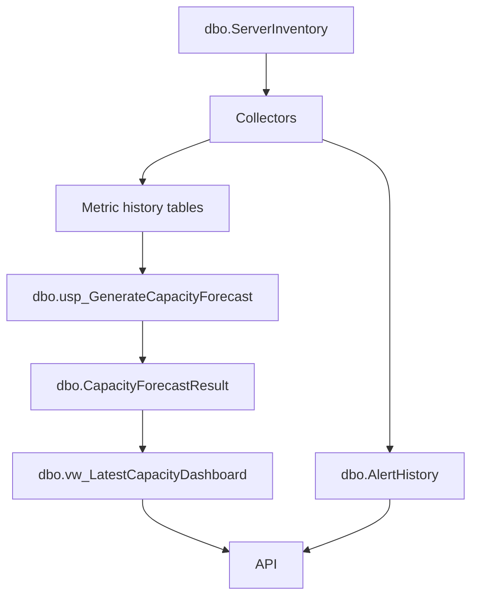

# Database

## Purpose

The `database` folder contains all SQL Server scripts needed to create and maintain the central `DBAUtility` repository.

The repository stores inventory, metric history, forecasts, and alerts. It is the system of record for the dashboard.

## Folder Structure

| Folder or file | Purpose |
| --- | --- |
| `001_Create_Database.sql` | Creates `DBAUtility` if it does not exist. |
| `tables/` | Creates repository tables and incremental table changes. |
| `procedures/` | Creates insert, forecast, and alert stored procedures. |
| `views/` | Creates reporting views used by the API. |
| `seed/` | Optional seed data for initial local setup. |

## Deployment Order

Always deploy in this order:

```text
database/001_Create_Database.sql
database/tables/*.sql
database/procedures/*.sql
database/views/*.sql
database/seed/*.sql
```

The pipeline `pipelines/deploy-database.yml` follows this order automatically.

## Main Data Model



## Repository Tables

| Table | Purpose |
| --- | --- |
| `dbo.ServerInventory` | Active source server inventory and connection metadata. |
| `dbo.DatabaseSizeHistory` | Database-level size history. |
| `dbo.FileSizeHistory` | File-level size and growth settings. |
| `dbo.DiskSpaceHistory` | Server volume free and total space. |
| `dbo.TableSizeHistory` | Table-level size and row count history. |
| `dbo.BackupSizeHistory` | Backup size history from `msdb`. |
| `dbo.TempDBUsageHistory` | TempDB usage history. |
| `dbo.CapacityForecastResult` | Latest calculated growth and capacity risk results. |
| `dbo.AlertHistory` | Active and historical alerts, including collector failures. |

## Repository Procedures

| Procedure | Purpose |
| --- | --- |
| `dbo.usp_InsertDatabaseSizeHistory` | Inserts database size rows. |
| `dbo.usp_InsertFileSizeHistory` | Inserts file size rows. |
| `dbo.usp_InsertDiskSpaceHistory` | Inserts disk space rows. |
| `dbo.usp_InsertTableSizeHistory` | Inserts table size rows. |
| `dbo.usp_InsertBackupSizeHistory` | Inserts backup size rows. |
| `dbo.usp_InsertTempDBUsageHistory` | Inserts TempDB rows. |
| `dbo.usp_GenerateCapacityForecast` | Calculates latest growth and risk. |
| `dbo.usp_GenerateAlerts` | Inserts forecast and operational alerts. |

## Repository Views

| View | Purpose |
| --- | --- |
| `dbo.vw_LatestCapacityDashboard` | Main dashboard table used by the API. |
| `dbo.vw_DatabaseSizeTrend` | Database trend chart data. |
| `dbo.vw_TopGrowingTables` | Top table growth view. |
| `dbo.vw_ActiveAlerts` | Active unresolved alert queue. |
| `dbo.vw_BackupGrowthTrend` | Backup growth trend data. |

## Time Storage

Repository timestamps are stored in UTC using SQL Server expressions such as:

```sql
SYSUTCDATETIME()
```

The web UI treats repository `DATETIME2` values as UTC and formats them into the selected UI time zone.

## Customer Lift-And-Shift Notes

For a customer environment:

1. Choose the SQL Server instance that will host `DBAUtility`.
2. Decide whether deployment uses Windows authentication or SQL authentication.
3. Run `DBA Capacity - Deploy Database`.
4. Confirm all tables, procedures, and views exist.
5. Confirm `dbo.ServerInventory.credential_key` exists.
6. Onboard source servers only after the repository is deployed.

## Validation Queries

```sql
SELECT name
FROM sys.databases
WHERE name = N'DBAUtility';
```

```sql
USE DBAUtility;

SELECT TABLE_SCHEMA, TABLE_NAME
FROM INFORMATION_SCHEMA.TABLES
ORDER BY TABLE_SCHEMA, TABLE_NAME;
```

```sql
SELECT server_name, server_type, connection_mode, credential_key, is_active
FROM dbo.ServerInventory
ORDER BY server_name;
```

