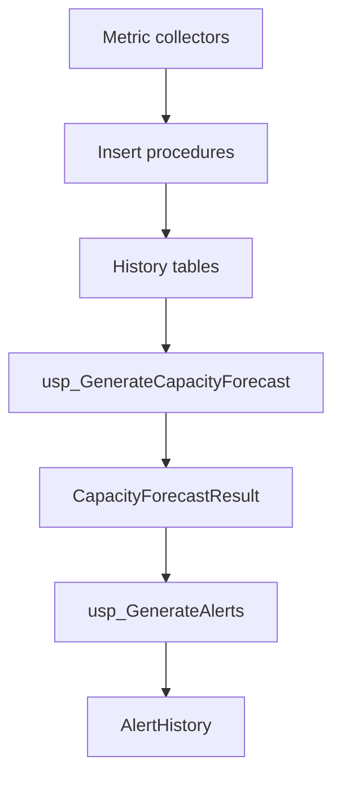

# Database Procedures

## Purpose

The `database/procedures` folder contains stored procedures used by the collector and API-facing reporting process.

There are two procedure categories:

1. Insert procedures called by collector scripts.
2. Forecast and alert procedures called after collection completes.

## Insert Procedures

| Procedure | Called by | Purpose |
| --- | --- | --- |
| `dbo.usp_InsertDatabaseSizeHistory` | `Collect-DatabaseSize.ps1` | Inserts database size rows. |
| `dbo.usp_InsertFileSizeHistory` | `Collect-FileSize.ps1` | Inserts file size rows. |
| `dbo.usp_InsertDiskSpaceHistory` | `Collect-DiskSpace.ps1` | Inserts disk volume rows. |
| `dbo.usp_InsertTableSizeHistory` | `Collect-TableSize.ps1` | Inserts table size and row count rows. |
| `dbo.usp_InsertBackupSizeHistory` | `Collect-BackupSize.ps1` | Inserts backup size rows. |
| `dbo.usp_InsertTempDBUsageHistory` | `Collect-TempDBUsage.ps1` | Inserts TempDB usage rows. |
| `dbo.usp_InsertLongRunningTransactionHistory` | `Collect-LongRunningTransactions.ps1` | Inserts open transaction evidence, duration, session metadata, current SQL text, and cached XML query plan when available. |
| `dbo.usp_InsertTempDBSessionUsageHistory` | `Collect-TempDBUsage.ps1` | Inserts top session-level TempDB consumers for alert drill-through. |
| `dbo.usp_InsertBlockingSessionHistory` | `Collect-BlockingSessions.ps1` | Inserts blocking-chain evidence for lead blockers and blocked sessions, including SQL text, lock evidence, and cached XML query plans when available. |
| `dbo.usp_InsertAlwaysOnHealthHistory` | `Collect-AlwaysOnHealth.ps1` | Inserts Always On replica and database synchronization evidence. |
| `dbo.usp_InsertReplicationHealthHistory` | `Collect-ReplicationHealth.ps1` | Inserts replication database flags and agent health/error evidence. |

Insert procedures centralize writes so collector scripts do not need direct table-specific insert logic scattered throughout the code.

## Forecast Procedure

```text
dbo.usp_GenerateCapacityForecast
```

This procedure calculates latest database capacity posture using repository history. It writes rows into:

```text
dbo.CapacityForecastResult
```

The forecast result includes:

- Current size
- Growth over recent windows
- Average daily growth
- Estimated days remaining
- Risk level
- Recommendation

The MVP forecast is intentionally simple. It is based on historical deltas rather than advanced seasonal modelling.

## Alert Procedure

```text
dbo.usp_GenerateAlerts
```

This procedure creates alert rows based on forecast risk, operational failures, and fast-moving SQL Server pressure signals.

Current alert categories include:

| Alert type | Main evidence |
| --- | --- |
| `CapacityRisk` | Latest forecast row from `dbo.CapacityForecastResult`. |
| `LogFileExhaustionRisk` | Current log size, effective cap, disk headroom, recent growth rate, and projected hours to cap. |
| `FullRecoveryNoLogBackup` | FULL recovery model, last observed log backup, and log reuse wait. |
| `LongRunningTransaction` | Open transaction duration, session, login, wait, blocking session, SQL text, and cached query plan when available. |
| `BlockingChain` | Lead blocker, blocker SQL/plan, blocked sessions, blocked SQL/plans, wait resources, likely blocked objects, and blocker-held locks. |
| `ActiveTransactionLogReuseWait` | `ACTIVE_TRANSACTION` log reuse wait with long transaction, blocking evidence, and cached query plans when available. |
| `AlwaysOnHealthIssue` | Always On replica/database health, disconnected replicas, suspended databases, queues, and connect errors. |
| `AlwaysOnLogReuseWait` | `AVAILABILITY_REPLICA` log reuse wait with Always On evidence. |
| `ReplicationAgentIssue` | Failed or retrying replication agents and error details from distribution metadata. |
| `ReplicationLogReuseWait` | `REPLICATION` log reuse wait with replication agent and database flag evidence. |
| `TempDBUsage` | Aggregate TempDB usage and top session-level consumers. |
| `DiskSpaceLow` | Latest disk capacity row by volume. |
| `BackupGrowth` | Latest backup size compared with recent average. |
| `CollectionFailure:*` | Collector error captured by `Common.ps1`. |

Each generated alert writes `source_script` and `details_json` into `dbo.AlertHistory`. The web UI reads those fields and shows them in the alert More info popup.

For plan-aware alerts, `details_json` can include `queryPlanXml`, `leadBlockerQueryPlanXml`, and `blockedQueryPlanXml`. The web UI renders these fields as execution plans and suppresses the raw XML from the generic evidence table.

The collector also directly writes `CollectionFailure:*` alerts when individual metric scripts fail.

## Execution Flow



## Deployment Behavior

Procedure scripts use:

```sql
CREATE OR ALTER PROCEDURE
```

That means repeated deployments update procedure definitions without requiring manual drops.

## Customer Lift-And-Shift Notes

For customer deployments:

1. Deploy table scripts before procedure scripts.
2. Make sure the collector repository identity can execute insert, forecast, and alert procedures.
3. Tune alert thresholds and recommendation text with the customer DBA team before production rollout.
4. Add SQL Agent or pipeline-based purge jobs if history grows quickly.

## Validation

```sql
USE DBAUtility;

SELECT name
FROM sys.procedures
WHERE schema_id = SCHEMA_ID(N'dbo')
ORDER BY name;
```

Manual forecast run:

```sql
EXEC dbo.usp_GenerateCapacityForecast;
EXEC dbo.usp_GenerateAlerts;
```
