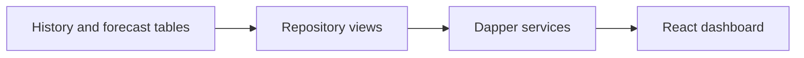

# Database Views

## Purpose

The `database/views` folder contains read models used by the API. Views keep API queries simpler and provide a stable reporting surface over repository history tables.

## Views

| View | Purpose | Primary consumer |
| --- | --- | --- |
| `dbo.vw_LatestCapacityDashboard` | Latest capacity posture per database. | Dashboard and capacity API. |
| `dbo.vw_DatabaseSizeTrend` | Time-series database size trend. | Database detail chart. |
| `dbo.vw_TopGrowingTables` | Largest table growth rows. | Top growing tables page. |
| `dbo.vw_ActiveAlerts` | Active unresolved alerts. | Alerts page. |
| `dbo.vw_BackupGrowthTrend` | Backup growth trend. | Future reporting and extension. |

## API Dependency

The API service layer queries these views instead of writing long SQL directly against every base table.

Example flow:



## Time Handling

Views expose repository timestamps stored in UTC. The API returns those timestamps to the web app, and the web app formats them into the selected UI time zone.

## Deployment Behavior

View scripts use:

```sql
CREATE OR ALTER VIEW
```

Repeated deployments update the view definition safely.

## Customer Lift-And-Shift Notes

For customer deployments:

1. Deploy tables first.
2. Deploy procedures second.
3. Deploy views after procedures.
4. Use views as the supported reporting surface for external read-only consumers.
5. Avoid custom customer reports directly against raw history tables unless retention and volume are understood.

## Validation

```sql
USE DBAUtility;

SELECT name
FROM sys.views
WHERE schema_id = SCHEMA_ID(N'dbo')
ORDER BY name;
```

Check dashboard data:

```sql
SELECT TOP (20) *
FROM dbo.vw_LatestCapacityDashboard
ORDER BY calculation_time DESC;
```

Check alerts:

```sql
SELECT TOP (20) *
FROM dbo.vw_ActiveAlerts
ORDER BY alert_time DESC;
```

