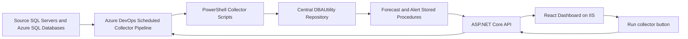
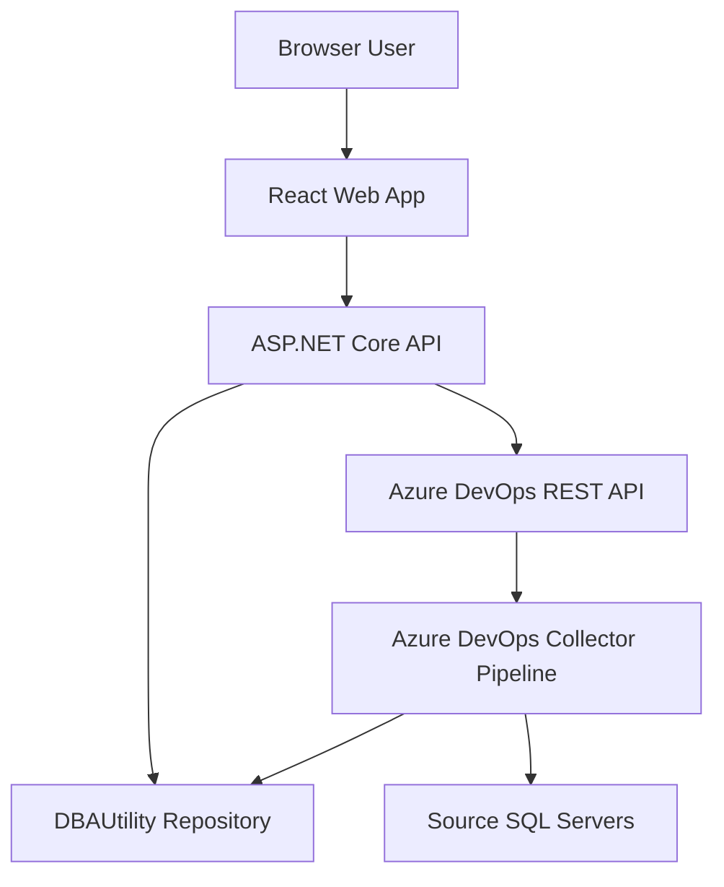

# DBA Capacity Intelligence Dashboard - Customer Lift-And-Shift Wiki

## 1. Purpose

This wiki explains how the DBA Capacity Intelligence Dashboard works, how it is configured, how the pipelines deploy it, and how to lift and shift the project into a customer environment.

The system is designed around a central `DBAUtility` SQL Server repository. Collector scripts gather capacity metrics from monitored SQL Servers and Azure SQL databases, write the data to `DBAUtility`, generate forecast and alert records, and expose the results through an ASP.NET Core API and React dashboard.

This document is intended for:

- DBA automation engineers
- SQL Server DBAs
- Azure DevOps administrators
- IIS administrators
- Customer environment deployment teams
- Operations teams that will support the system after handover

## 1.1 Minimum-Effort Migration Path

Use this path when the goal is to deploy quickly into a customer environment with the smallest number of code changes.

### Recommended Target Shape

Keep the application layout the same and change only environment-specific configuration:

| Area | Low-effort choice |
| --- | --- |
| Repository database | `DBAUtility` on a customer SQL Server. |
| Automation host | Lowest effort: one Windows server runs the Azure DevOps self-hosted agent and IIS. Real-world split deployments can use separate automation and IIS VMs. |
| API hosting | IIS site on port `5088` unless the customer requires another port. |
| Web hosting | IIS static site on a server name or DNS alias, preferably standard `80` or `443`. Use `8080` only for local/dev or when the customer explicitly wants a non-standard port. |
| Secrets | Azure DevOps variable group named `configs`. |
| Collector execution | `DBA Capacity - Collect Metrics` scheduled pipeline plus dashboard Run collector button. |
| Source credentials | `SOURCE_SQL_CREDENTIALS_JSON` secret with credential keys referenced by `dbo.ServerInventory`. |

### Fastest Deployment Checklist

1. Copy or import the repository into the customer Azure DevOps project.
2. Install a self-hosted Windows Azure DevOps agent on the customer automation host. If IIS is on a separate VM, see the topology note below.
3. Run the deployment agent service as a dedicated local administrator account on the machine where IIS deployment tasks execute.
4. Update only the automation pipeline `pool`, `Agent.Name`, and `projectRoot` values if they differ. For API/web IIS deploys, prefer queue-time `iisAgentPool` and `iisAgentName`.
5. Create the Azure DevOps variable group named `configs`.
6. Fill the variables in section 12.
7. Create the five pipelines from the YAML files in section 15 phase 6.
8. Set `AZDO_COLLECTOR_PIPELINE_NAME = DBA Capacity - Collect Metrics`.
9. Optionally set `AZDO_COLLECTOR_PIPELINE_ID` after the pipeline is created.
10. Run `DBA Capacity - Deploy Database`.
11. Run `DBA Capacity - Onboard Server` for each SQL Server or Azure SQL logical server.
12. Run `DBA Capacity - Collect Metrics` once manually.
13. Run `DBA Capacity - Deploy API`.
14. Run `DBA Capacity - Deploy Web`.
15. Open the dashboard and click **Run collector** to verify the dashboard-triggered pipeline path.
16. Confirm the scheduled collector interval with the customer.

### What Should Not Need Code Changes

For a standard customer deployment, do not edit collector scripts, API code, React code, SQL table definitions, or stored procedures. Prefer changing:

- Azure DevOps variable group values.
- Pipeline pool and agent demand.
- `projectRoot` if the repo layout changes.
- IIS port/site variables.
- `SOURCE_SQL_CREDENTIALS_JSON`.
- Server rows through the onboard pipeline.

### Agent And IIS Topology Options

The self-hosted Azure DevOps agent and IIS do not have to be on the same VM in real customer environments.

| Topology | When to use | Pipeline impact |
| --- | --- | --- |
| Single VM: agent and IIS together | Fastest proof-of-value or small customer estate. | Current YAML works as-is because IIS deployment is local to the agent. |
| Split VMs: automation agent separate from IIS | Production environments with dedicated automation and web tiers. | Collection/database/onboard pipelines can run on the automation VM, but API/web IIS deployment must run on an agent installed on the IIS VM or use a remote deployment mechanism. |
| Two agents: automation agent plus IIS deployment agent | Recommended split model. | Point `collect-capacity.yml`, `deploy-database.yml`, and `onboard-server.yml` at the automation pool; queue `deploy-api.yml` and `deploy-web.yml` with the IIS `iisAgentPool` and `iisAgentName` values. |
| Remote IIS deployment from automation agent | Use only when the customer standardizes on WinRM/PowerShell remoting or another deployment tool. | Extend `deploy-api.yml` and `deploy-web.yml` to copy artifacts and run IIS commands remotely. The current YAML does not do remote IIS deployment. |

Important: the current `deploy-api.yml` and `deploy-web.yml` scripts use the local IIS `WebAdministration` module and local paths such as `C:\inetpub\...`. Therefore, out of the box, those deployment pipelines must execute on the IIS VM.

## 2. High-Level Architecture



## 3. Components

| Component | Folder | Purpose |
| --- | --- | --- |
| Repository database | `database/` | Creates `DBAUtility`, history tables, inventory, alerts, forecast procedures, and reporting views. |
| Collector scripts | `collector/` | PowerShell scripts that read active inventory, collect metrics, and insert repository history rows. |
| API | `api/DBA.Capacity.Api/` | ASP.NET Core API that queries `DBAUtility` through Dapper, deletes selected alert rows, and queues the collector pipeline through Azure DevOps. |
| Web app | `web/dba-capacity-web/` | React Vite dashboard for capacity trends, top growing tables, and alerts. |
| Pipelines | `pipelines/` | Azure DevOps YAML pipelines for database deployment, server onboarding, collection, API deploy, and web deploy. |
| Documentation | `docs/` | Architecture, setup, screenshots, and this lift-and-shift guide. |

## 4. Data Flow

1. `pipelines/collect-capacity.yml` runs manually, on a cron schedule, or from the dashboard Run collector button through the API.
2. The collector connects to the `DBAUtility` repository.
3. `Collect-CapacityMetrics.ps1` reads active rows from `dbo.ServerInventory`.
4. Each active server is processed with its configured `server_type`, `connection_mode`, and `credential_key`.
5. Metric scripts collect database size, file size, disk space, table size, backup size, TempDB usage, TempDB top consumers, long-running transactions, blocking chains, Always On health, and replication health where supported.
6. Collector scripts call repository insert stored procedures.
7. `Run-Forecast.ps1` executes forecast and alert generation procedures.
8. The API reads from repository views and tables.
9. The React web app calls the API and displays dashboards.
10. When a dashboard user clicks **Run collector**, the web app calls `POST /api/collector-run`; the API uses a server-side PAT to queue the Azure DevOps pipeline and then exposes run status through `GET /api/collector-run`.

## 5. Security Boundary

The frontend never connects directly to SQL Server.



Important security points:

- SQL credentials are not committed to Git.
- Collector credentials are read from Azure DevOps secret variables.
- Source SQL passwords are not stored in `DBAUtility`.
- The API should use only read access to `DBAUtility`.
- The API stores the Azure DevOps PAT server-side in production configuration written by the deploy pipeline.
- The dashboard user does not need Azure DevOps pipeline permission to use the Run collector button.
- The web app receives dashboard JSON only.
- The current MVP does not enforce user login or role-based authorization.

## 6. Repository Database

The central repository database is named:

```text
DBAUtility
```

It stores:

- Server inventory
- Database size history
- File size history
- Disk space history
- Table size history
- Backup size history
- TempDB usage history
- Long-running transaction history
- Session-level TempDB consumer history
- Blocking-chain history
- Always On health history
- Replication health history
- Forecast results
- Alert history with source scripts and structured evidence JSON

### Deployment Script Order

The database pipeline runs scripts in this order:

```text
database/001_Create_Database.sql
database/tables/*.sql
database/procedures/*.sql
database/views/*.sql
database/seed/*.sql
```

The table scripts are intended to be idempotent. They create missing objects and include incremental changes such as `credential_key` on `dbo.ServerInventory`.

### Server Inventory

The key inventory table is:

```text
dbo.ServerInventory
```

Important columns:

| Column | Meaning |
| --- | --- |
| `server_name` | SQL Server instance name or Azure SQL logical server name. |
| `environment` | Environment label such as Development, Test, Production, DR. |
| `server_type` | `SQLServer`, `AzureSQL`, or `ManagedInstance`. |
| `connection_mode` | `SqlAuth`, `WindowsAuth`, `AzureADPassword`, `AzureADIntegrated`, or `ManagedIdentity`. Current collector supports `SqlAuth`, `WindowsAuth`, `AzureADPassword`, and `AzureADIntegrated`. |
| `credential_key` | Logical key used to pick source credentials from `SOURCE_SQL_CREDENTIALS_JSON`. |
| `is_active` | `1` means the collector processes the server. |

Example:

```sql
SELECT
    server_name,
    environment,
    server_type,
    connection_mode,
    credential_key,
    is_active
FROM dbo.ServerInventory
ORDER BY server_name;
```

## 7. Collector Behavior

The collector entry point is:

```text
collector/Collect-CapacityMetrics.ps1
```

It performs these steps:

1. Starts transcript logging under `collector/logs/`.
2. Ensures `dbatools` is installed and imported.
3. Verifies the repository is reachable.
4. Reads active monitored servers from `dbo.ServerInventory`.
5. Sets per-server environment values for child collector scripts.
6. Runs each supported metric collector.
7. Writes collection failures into `dbo.AlertHistory`.
8. Generates forecasts and alerts.
9. Publishes collector logs as a pipeline artifact.

### Collector Scripts

| Script | Purpose | Azure SQL Database support |
| --- | --- | --- |
| `Collect-DatabaseSize.ps1` | Database size by database. | Supported by querying each database. |
| `Collect-FileSize.ps1` | File size and free space by database file. | Supported where permissions allow. |
| `Collect-DiskSpace.ps1` | Instance disk volumes. | Skipped for Azure SQL Database. |
| `Collect-TableSize.ps1` | Table size and row counts. | Supported where permissions allow. |
| `Collect-BackupSize.ps1` | Backup history from `msdb`. | Skipped for Azure SQL Database. |
| `Collect-TempDBUsage.ps1` | Aggregate TempDB usage and top session-level consumers. | Skipped for Azure SQL Database. |
| `Collect-LongRunningTransactions.ps1` | Open transaction duration, owning session, blocking/wait data, and SQL text. | Skipped for Azure SQL Database. |
| `Collect-BlockingSessions.ps1` | Lead blocker, blocked sessions, wait resources, likely blocked objects, and SQL text. | Skipped for Azure SQL Database. |
| `Collect-AlwaysOnHealth.ps1` | Always On dashboard-style replica and database health, queues, suspend reasons, and connection errors. | Skipped for Azure SQL Database. |
| `Collect-ReplicationHealth.ps1` | Replication database flags and latest local distribution agent status/errors. | Skipped for Azure SQL Database. |
| `Run-Forecast.ps1` | Forecast and alert generation. | Repository only. |

### Azure SQL Database Notes

Azure SQL Database does not expose the same instance-level DMVs as SQL Server. For that reason:

- Disk space collection is skipped.
- Backup size collection is skipped.
- TempDB usage collection is skipped.
- Long-running transaction collection is skipped.
- Blocking, Always On, and replication instance-level collection is skipped.
- Database size and file size are collected per database.
- Table size is collected per database where the login has permission.

## 7.1 Alert Evidence And More Info Popup

Alerts are not just plain messages. `dbo.AlertHistory` stores:

| Column | Purpose |
| --- | --- |
| `source_script` | Script or procedure chain that generated the alert. |
| `details_json` | Structured evidence shown by the web More info popup. |

Important alert signals:

| Alert type | What it checks | Main source |
| --- | --- | --- |
| `LogFileExhaustionRisk` | Whether the transaction log can hit the lower of configured max size, SQL Server 2 TB log-file cap, or available disk headroom; estimates hours to cap from recent growth. | `Collect-FileSize.ps1`, `dbo.FileSizeHistory`, `dbo.usp_GenerateAlerts`. |
| `FullRecoveryNoLogBackup` | FULL recovery databases with no observed log backup, stale log backup, or `LOG_BACKUP` reuse wait. | `Collect-FileSize.ps1`, `Collect-BackupSize.ps1`. |
| `LongRunningTransaction` | Open user transactions over the threshold because they can block log truncation. | `Collect-LongRunningTransactions.ps1`. |
| `BlockingChain` | Lead blockers, blocked sessions, wait resources, blocked objects, and SQL text. | `Collect-BlockingSessions.ps1`. |
| `ActiveTransactionLogReuseWait` | `log_reuse_wait_desc = ACTIVE_TRANSACTION` with long transaction and blocking evidence. | `Collect-FileSize.ps1`, `Collect-LongRunningTransactions.ps1`, `Collect-BlockingSessions.ps1`. |
| `AlwaysOnHealthIssue` | Disconnected, unhealthy, suspended, or lagging Always On replica/database rows. | `Collect-AlwaysOnHealth.ps1`. |
| `AlwaysOnLogReuseWait` | `log_reuse_wait_desc = AVAILABILITY_REPLICA` with Always On evidence. | `Collect-FileSize.ps1`, `Collect-AlwaysOnHealth.ps1`. |
| `ReplicationAgentIssue` | Failed or retrying replication agents and local distribution errors. | `Collect-ReplicationHealth.ps1`. |
| `ReplicationLogReuseWait` | `log_reuse_wait_desc = REPLICATION` with replication evidence. | `Collect-FileSize.ps1`, `Collect-ReplicationHealth.ps1`. |
| `TempDBUsage` | High TempDB usage and the top sessions consuming TempDB at collection time. | `Collect-TempDBUsage.ps1`. |
| `CollectionFailure:*` | Collector failures with the failing metric script and error text. | `collector/Common.ps1`. |

After deploying this version, existing alerts will not have evidence JSON. Run a new collection so newly generated alerts populate the popup.

## 8. Source Credential Model

Different source servers can use different SQL usernames and passwords.

The inventory row only stores a `credential_key`, for example:

```text
default
azuresql-sql
azuresql-aad
prod-east
customer-a
```

The actual usernames and passwords are stored in Azure DevOps variable group `configs` as a secret variable named:

```text
SOURCE_SQL_CREDENTIALS_JSON
```

Example:

```json
{"default":{"user":"sa","password":"local-source-password"},"azuresql-sql":{"user":"azure_sql_admin","password":"azure-source-password"},"azuresql-aad":{"user":"dba.user@contoso.com","password":"entra-id-password"}}
```

The collector resolves credentials as follows:

1. Read `ServerInventory.credential_key`.
2. Find that key in `SOURCE_SQL_CREDENTIALS_JSON`.
3. Use the matching `user` or `username` and `password`.
4. If the key is `default` and no JSON entry exists, fall back to `SQL_USER` and `SQL_PASSWORD`.

Connection mode behavior:

| Mode | Credential behavior |
| --- | --- |
| `SqlAuth` | Reads SQL username/password from `SOURCE_SQL_CREDENTIALS_JSON` or default `SQL_USER`/`SQL_PASSWORD`. |
| `WindowsAuth` | Uses the Windows identity running the collector process. A Windows username/password cannot be passed in the SQL connection string. |
| `AzureADPassword` | Reads Entra ID username/password from `SOURCE_SQL_CREDENTIALS_JSON`. |
| `AzureADIntegrated` | Uses the Windows/domain/AAD-joined identity running the collector process for integrated Azure SQL authentication. |
| `ManagedIdentity` | Reserved for a future Microsoft.Data.SqlClient token-based collector implementation. |

Why `connectionMode` and `credentialKey` are both needed:

- `connectionMode` chooses the authentication method and connection-string behavior.
- `credentialKey` chooses which secret entry to use when that method needs a username/password.
- This lets many servers share the same authentication method while using different credentials.
- It also lets Azure SQL SQL-auth and Azure SQL Entra-password auth live side by side without hard-coding usernames in `DBAUtility`.
- `credentialKey` is free text in the onboard pipeline; it must match a key in `SOURCE_SQL_CREDENTIALS_JSON` unless it is `default`, which can fall back to `SQL_USER` and `SQL_PASSWORD`.

Common pairings:

| Target | `connectionMode` | `credentialKey` | Why |
| --- | --- | --- | --- |
| SQL Server with shared SQL login | `SqlAuth` | `default` | Uses default SQL login from `SOURCE_SQL_CREDENTIALS_JSON` or `SQL_USER`/`SQL_PASSWORD`. |
| Production SQL Server with its own SQL login | `SqlAuth` | `prod` | Uses a named secret entry such as `prod`. |
| SQL Server trusted connection | `WindowsAuth` | `default` | Uses the agent service account; no password is read from the JSON. |
| Azure SQL SQL authentication | `SqlAuth` | `azuresql-sql` | Azure SQL does not use `sa`; this key stores the Azure SQL login. |
| Azure SQL Entra password authentication | `AzureADPassword` | `azuresql-aad` | This key stores the Entra ID username/password. |
| Azure SQL integrated authentication | `AzureADIntegrated` | `default` | Uses the domain/AAD-joined agent identity; no password is read from the JSON. |

### Example Inventory Updates

On-premises SQL Server using `sa`:

```sql
UPDATE dbo.ServerInventory
SET server_type = 'SQLServer',
    connection_mode = 'SqlAuth',
    credential_key = 'default',
    updated_at = SYSUTCDATETIME()
WHERE server_name = N'DESKTOP-CIS3NI4';
```

Azure SQL Database using an Azure SQL admin login:

```sql
UPDATE dbo.ServerInventory
SET server_type = 'AzureSQL',
    connection_mode = 'SqlAuth',
    credential_key = 'azuresql-sql',
    updated_at = SYSUTCDATETIME()
WHERE server_name = N'shamvil.database.windows.net';
```

Azure SQL Database using Entra ID password authentication:

```sql
UPDATE dbo.ServerInventory
SET server_type = 'AzureSQL',
    connection_mode = 'AzureADPassword',
    credential_key = 'azuresql-aad',
    updated_at = SYSUTCDATETIME()
WHERE server_name = N'shamvil.database.windows.net';
```

SQL Server using Windows trusted authentication:

```sql
UPDATE dbo.ServerInventory
SET server_type = 'SQLServer',
    connection_mode = 'WindowsAuth',
    credential_key = 'default',
    updated_at = SYSUTCDATETIME()
WHERE server_name = N'prod-sql-01';
```

## 9. API

The API project is:

```text
api/DBA.Capacity.Api/DBA.Capacity.Api.csproj
```

The API uses:

- ASP.NET Core
- Dapper
- SQL Server
- Swagger
- CORS
- Central error handling middleware

### API Endpoints

| Endpoint | Purpose |
| --- | --- |
| `GET /` | Redirects to Swagger. |
| `GET /health` | Basic health check. |
| `GET /swagger` | Swagger UI. |
| `GET /api/dashboard/summary` | Dashboard summary cards. |
| `GET /api/capacity/databases` | Database capacity forecast rows. |
| `GET /api/capacity/databases/{serverName}/{databaseName}/trend?days=90` | Trend chart data. |
| `GET /api/capacity/top-growing-tables?limit=20` | Top growing tables. |
| `GET /api/alerts/active` | Active unresolved alerts. |
| `GET /api/servers` | Active server inventory. |

Dashboard and capacity endpoints support environment filtering with the same labels used by `pipelines/onboard-server.yml`:

```text
Development
Test
QA
UAT
Production
DR
```

Example:

```text
GET /api/capacity/databases?environment=Production
GET /api/dashboard/summary?environment=Production
```

### API Configuration

Local app settings are in:

```text
api/DBA.Capacity.Api/appsettings.json
```

Production pipeline configuration is written to:

```text
appsettings.Production.json
```

Important API variables:

| Variable | Purpose |
| --- | --- |
| `DBA_API_CONNECTION_STRING` | API connection string to `DBAUtility`. |
| `DBA_API_ALLOWED_ORIGINS` | Semicolon-separated browser origins allowed to call the API. Use the dashboard server name or DNS alias, not the API URL. |
| `IIS_API_SITE_NAME` | IIS site name for the API. |
| `IIS_API_APP_POOL` | IIS app pool for the API. |
| `IIS_API_PHYSICAL_PATH` | Physical publish path. |
| `IIS_API_PORT` | API HTTP port. |

Example:

```text
DBA_API_CONNECTION_STRING = Server=.;Database=DBAUtility;Trusted_Connection=True;TrustServerCertificate=True;
DBA_API_ALLOWED_ORIGINS = https://dba-capacity.contoso.local
IIS_API_PORT = 5088
```

CORS origin format must match what the browser sends:

```text
scheme://host[:port]
```

Use the customer dashboard hostname or DNS alias:

```text
https://dba-capacity.contoso.local
http://dba-capacity-web
```

Do not include the port when the dashboard uses standard HTTPS `443` or HTTP `80`. Include the port only when IIS is bound to a non-standard port:

```text
http://dba-capacity-web:8080
```

## 10. Web App

The web app project is:

```text
web/dba-capacity-web
```

It uses:

- React
- Vite
- React Router HashRouter
- Recharts
- Lucide icons

### Web Configuration

The key build-time variable is:

```text
VITE_API_BASE_URL
```

Example:

```text
VITE_API_BASE_URL = http://localhost:5088/api
```

This value is compiled into the static web build. If the API URL changes, rebuild and redeploy the web app.

### IIS Routing

The web app uses `HashRouter`. That means URLs look like:

```text
http://localhost:8080/#/
http://localhost:8080/#/alerts
```

This avoids requiring IIS URL Rewrite for client-side routes.

### Time Zone Handling

The UI has a header-level time zone selector.

The repository stores timestamps using UTC values such as `SYSUTCDATETIME()`. SQL Server `DATETIME2` values may be returned by the API without a `Z` suffix, so the web formatter treats repository timestamps as UTC and then formats them into the selected UI time zone.

The time zone preference is stored in browser local storage.

## 11. Azure DevOps Pipelines

Pipeline files:

| Pipeline | File | Purpose |
| --- | --- | --- |
| Deploy Database | `pipelines/deploy-database.yml` | Deploys `DBAUtility` scripts. |
| Onboard Server | `pipelines/onboard-server.yml` | Adds or updates one `dbo.ServerInventory` row. |
| Collect Metrics | `pipelines/collect-capacity.yml` | Runs collector scripts and publishes logs. |
| Deploy API | `pipelines/deploy-api.yml` | Builds API, publishes artifact, deploys to IIS. |
| Deploy Web | `pipelines/deploy-web.yml` | Builds React app, publishes artifact, deploys to IIS. |

### Current Agent Assumptions

The current YAMLs target:

```text
Pool: Shamvil-pool
Agent: shamvil
OS: Windows_NT
```

Customer environments must update the `pool` and `demands` blocks if the pool or agent name changes.

Example:

```yaml
pool:
  name: Customer-DBA-Pool
  demands:
    - Agent.Name -equals customer-dba-agent-01
    - Agent.OS -equals Windows_NT
```

### Project Root Assumption

The YAMLs currently assume the project is checked out under:

```text
$(Build.SourcesDirectory)\dba-capacity-intelligence-dashboard
```

That is controlled by:

```yaml
variables:
  - name: projectRoot
    value: dba-capacity-intelligence-dashboard
```

If the customer repository places the project files at the repository root, change:

```yaml
value: dba-capacity-intelligence-dashboard
```

to:

```yaml
value: .
```

### Scheduled Collector

The collector has a YAML cron schedule:

```yaml
schedules:
  - cron: "*/10 * * * *"
    displayName: Run every 10 minutes
    branches:
      include:
        - master
        - main
    always: true
```

Azure DevOps cron values are UTC.

For customer environments, review whether every 10 minutes is appropriate. A 10-minute schedule is around 1008 runs per week, which is close to common service limits. A safer production default may be:

```yaml
cron: "*/15 * * * *"
```

## 12. Azure DevOps Variable Group

All YAMLs import a variable group named:

```text
configs
```

Create this group in Azure DevOps:

```text
Pipelines -> Library -> Variable groups -> New variable group
```

### Required Variables

| Variable | Secret | Example | Purpose |
| --- | --- | --- | --- |
| `DBA_REPOSITORY_SERVER` | No | `.` or `sqlrepo01` | SQL Server hosting `DBAUtility`. |
| `DBA_REPOSITORY_DB` | No | `DBAUtility` | Repository database name. |
| `DBA_SQL_AUTH_MODE` | No | `WindowsAuth` or `SqlAuth` | Repository connection mode for pipelines. |
| `SQL_USER` | Yes | `collector_login` | Repository SQL login or fallback source login. |
| `SQL_PASSWORD` | Yes | `********` | Password for `SQL_USER`. |
| `SOURCE_SQL_CREDENTIALS_JSON` | Yes | JSON map | Source SQL credential map. |
| `VITE_API_BASE_URL` | No | `http://localhost:5088/api` | API URL compiled into web app. |
| `IIS_API_SITE_NAME` | No | `DBA Capacity API` | API IIS site name. |
| `IIS_API_APP_POOL` | No | `DBACapacityApi` | API app pool. |
| `IIS_API_PHYSICAL_PATH` | No | `C:\inetpub\dba-capacity-api` | API deploy path. |
| `IIS_API_PORT` | No | `5088` | API port. |
| `IIS_WEB_SITE_NAME` | No | `DBA Capacity Dashboard` | Web IIS site name. |
| `IIS_WEB_APP_POOL` | No | `DBACapacityWeb` | Web app pool. |
| `IIS_WEB_PHYSICAL_PATH` | No | `C:\inetpub\dba-capacity-web` | Web deploy path. |
| `IIS_WEB_PORT` | No | `80`, `443`, or `8080` | Web port. Prefer standard `80` or `443` for customer DNS aliases. |
| `DBA_API_CONNECTION_STRING` | Yes | SQL connection string | API connection to `DBAUtility`. |
| `DBA_API_ALLOWED_ORIGINS` | No | `https://dba-capacity.contoso.local` | Dashboard browser origin allowed by API CORS. Use the dashboard server name or DNS alias. |
| `AZDO_ORGANIZATION` | No | `customer-org` | Azure DevOps organization used by the API to trigger the collector pipeline. |
| `AZDO_PROJECT` | No | `CustomerProject` | Azure DevOps project containing the collector pipeline. |
| `AZDO_COLLECTOR_PIPELINE_NAME` | No | `DBA Capacity - Collect Metrics` | Pipeline name used when the numeric pipeline id is not set. |
| `AZDO_COLLECTOR_PIPELINE_ID` | No | `27` | Optional numeric id of the collect metrics pipeline. Preferred after the pipeline is created. |
| `AZDO_PAT` | Yes | `********` | Automation PAT used by the API to queue and read collector pipeline runs. |

### Repository Authentication Options

Windows authentication:

```text
DBA_REPOSITORY_SERVER = .
DBA_REPOSITORY_DB = DBAUtility
DBA_SQL_AUTH_MODE = WindowsAuth
```

SQL authentication:

```text
DBA_REPOSITORY_SERVER = customer-sqlrepo-01
DBA_REPOSITORY_DB = DBAUtility
DBA_SQL_AUTH_MODE = SqlAuth
SQL_USER = dba_capacity_repo_user
SQL_PASSWORD = ********
```

For local SQL Server on the same machine as the agent, prefer `.` over `localhost` when using Windows authentication from a service account.

### Dashboard Run Collector Button Variables

The dashboard button does not call Azure DevOps directly. It calls:

```text
POST /api/collector-run
```

The API then queues `DBA Capacity - Collect Metrics` using the Azure DevOps settings from `configs`.

Minimum setup:

```text
AZDO_ORGANIZATION = <customer-ado-organization>
AZDO_PROJECT = <customer-ado-project>
AZDO_COLLECTOR_PIPELINE_NAME = DBA Capacity - Collect Metrics
AZDO_PAT = <secret automation PAT>
```

Preferred setup after the pipeline exists:

```text
AZDO_COLLECTOR_PIPELINE_ID = <definitionId from the pipeline URL>
```

Where to find the pipeline id:

1. Open Azure DevOps.
2. Open **Pipelines**.
3. Open **DBA Capacity - Collect Metrics**.
4. Look at the browser URL.
5. Use the number after `definitionId=`.

Example:

```text
https://dev.azure.com/customer-org/CustomerProject/_build?definitionId=27
```

Set:

```text
AZDO_COLLECTOR_PIPELINE_ID = 27
```

Create `AZDO_PAT` under a service or automation identity. Grant only the permission needed to read and run pipelines. Mark the variable secret.

## 13. IIS Deployment

### Default API Site

```text
Site: DBA Capacity API
App pool: DBACapacityApi
Path: C:\inetpub\dba-capacity-api
URL: http://localhost:5088
```

### Default Web Site

```text
Site: DBA Capacity Dashboard
App pool: DBACapacityWeb
Path: C:\inetpub\dba-capacity-web
URL: http://localhost:8080
```

### Agent Permission Requirement

The API and web deploy pipelines create or update IIS sites and app pools. With the current YAML, those pipelines execute IIS commands locally on the agent machine. Therefore, the agent that runs `deploy-api.yml` and `deploy-web.yml` must be on the IIS VM and must run as a local administrator.

If the customer keeps the main automation agent on a separate VM, use one of these patterns:

1. Install a second self-hosted agent on the IIS VM and point only `deploy-api.yml` and `deploy-web.yml` at that agent.
2. Extend the deploy YAMLs to use WinRM/PowerShell remoting, copy artifacts to the IIS VM, and run IIS commands remotely.
3. Use a customer-approved deployment tool such as Octopus Deploy, Azure DevOps Environments deployment groups, or a release pipeline that targets the IIS VM.

Check the service account:

```powershell
Get-CimInstance Win32_Service |
  Where-Object { $_.Name -like 'vstsagent*' } |
  Select-Object Name, StartName, State
```

If the service runs as `NT AUTHORITY\NETWORK SERVICE`, IIS deployment will fail with:

```text
IIS deployment requires the Azure DevOps agent process to run as local Administrator.
```

Recommended customer setup for the IIS deployment agent:

1. Create a dedicated local account, for example `.\azdoagent`.
2. Add it to the local Administrators group.
3. Run the Azure DevOps agent service as that account.
4. Restart the agent service.

### Windows-Level Access And Commands

Run these commands from an elevated PowerShell session on the relevant Windows VM. For domain service accounts, replace local examples such as `.\azdoagent` with the domain account, for example `CONTOSO\svc-dba-iisdeploy`.

#### Access Matrix

| Identity | Where | Required Windows-level access | Why |
| --- | --- | --- | --- |
| Automation agent service account | Automation VM | Log on as a service, read/write to the agent folder, outbound HTTPS to Azure DevOps, network access to repository/source SQL Servers. Local admin is optional unless customer policy requires it for tool installation. Standard domain service account or gMSA is supported. | Runs database deploy, onboard, and collector pipelines. |
| IIS deployment agent service account | IIS VM | Local Administrators, log on as a service, read/write to the agent folder, outbound HTTPS to Azure DevOps, modify access to IIS publish paths. Standard domain service account or gMSA is supported. | Current API/web deploy YAML creates IIS sites, app pools, bindings, file copies, and ACLs locally. |
| `IIS APPPOOL\DBACapacityApi` | IIS VM | Read/execute on `C:\inetpub\dba-capacity-api`. | Runs the ASP.NET Core API. SQL permissions are handled separately in SQL Server. |
| `IIS APPPOOL\DBACapacityWeb` | IIS VM | Read/execute on `C:\inetpub\dba-capacity-web`. | Serves the static React build. |
| DBA or deployment admin | IIS VM | Temporary local Administrator during installation, or equivalent delegated IIS administration. | Installs Windows features, hosting bundle, firewall rules, and agents. |

#### Create A Local Agent Account

Use this only when the customer is not using a domain service account:

```powershell
$Password = Read-Host "Enter password for .\azdoagent" -AsSecureString
New-LocalUser `
  -Name "azdoagent" `
  -Password $Password `
  -FullName "Azure DevOps DBA Capacity Agent" `
  -Description "Runs DBA Capacity Azure DevOps pipelines" `
  -PasswordNeverExpires
```

For the IIS deployment agent, add the account to local Administrators:

```powershell
Add-LocalGroupMember -Group "Administrators" -Member ".\azdoagent"
```

For a domain service account on the IIS VM:

```powershell
Add-LocalGroupMember -Group "Administrators" -Member "CONTOSO\svc-dba-iisdeploy"
```

Do not add the automation-only collector agent to local Administrators unless it also performs local IIS deployment or the customer requires admin rights for software installation.

#### Use A Group Managed Service Account

If the customer provides a managed service account or gMSA, the account normally ends with `$`, for example:

```text
CONTOSO\svc-dba-automation$
CONTOSO\svc-dba-iisdeploy$
```

Do not provide `--windowsLogonPassword` for a gMSA. Windows retrieves and rotates the password automatically.

Prerequisites:

- The gMSA already exists in Active Directory.
- The target VM is allowed to retrieve the gMSA password.
- The agent VM has the AD PowerShell module or equivalent customer tooling to install/test the gMSA locally.

On the target VM, run elevated:

```powershell
Install-WindowsFeature RSAT-AD-PowerShell
Install-ADServiceAccount svc-dba-automation
Test-ADServiceAccount svc-dba-automation
```

For an IIS deployment gMSA:

```powershell
Install-WindowsFeature RSAT-AD-PowerShell
Install-ADServiceAccount svc-dba-iisdeploy
Test-ADServiceAccount svc-dba-iisdeploy
Add-LocalGroupMember -Group "Administrators" -Member 'CONTOSO\svc-dba-iisdeploy$'
```

Use single quotes around gMSA names in PowerShell commands so the trailing `$` is treated as literal text.

#### Create Agent And Publish Folders

Automation VM:

```powershell
New-Item -ItemType Directory -Force -Path "C:\agent" | Out-Null
icacls "C:\agent" /grant "CONTOSO\svc-dba-automation:(OI)(CI)F" /T
```

IIS VM:

```powershell
New-Item -ItemType Directory -Force -Path "C:\iis-agent" | Out-Null
New-Item -ItemType Directory -Force -Path "C:\inetpub\dba-capacity-api" | Out-Null
New-Item -ItemType Directory -Force -Path "C:\inetpub\dba-capacity-web" | Out-Null

icacls "C:\iis-agent" /grant "CONTOSO\svc-dba-iisdeploy:(OI)(CI)F" /T
icacls "C:\inetpub\dba-capacity-api" /grant "CONTOSO\svc-dba-iisdeploy:(OI)(CI)M" /T
icacls "C:\inetpub\dba-capacity-web" /grant "CONTOSO\svc-dba-iisdeploy:(OI)(CI)M" /T
```

If using the local account from the previous example:

```powershell
icacls "C:\iis-agent" /grant ".\azdoagent:(OI)(CI)F" /T
icacls "C:\inetpub\dba-capacity-api" /grant ".\azdoagent:(OI)(CI)M" /T
icacls "C:\inetpub\dba-capacity-web" /grant ".\azdoagent:(OI)(CI)M" /T
```

If using a gMSA:

```powershell
icacls "C:\agent" /grant 'CONTOSO\svc-dba-automation$:(OI)(CI)F' /T
icacls "C:\iis-agent" /grant 'CONTOSO\svc-dba-iisdeploy$:(OI)(CI)F' /T
icacls "C:\inetpub\dba-capacity-api" /grant 'CONTOSO\svc-dba-iisdeploy$:(OI)(CI)M' /T
icacls "C:\inetpub\dba-capacity-web" /grant 'CONTOSO\svc-dba-iisdeploy$:(OI)(CI)M' /T
```

#### Install IIS Windows Features

On the IIS VM:

```powershell
Install-WindowsFeature `
  -Name Web-Server,Web-Mgmt-Tools,Web-Scripting-Tools `
  -IncludeManagementTools

Import-Module WebAdministration
Get-Command New-Website
```

Install the ASP.NET Core Hosting Bundle on the IIS VM before deploying the API. After installation, verify the ASP.NET Core IIS module is available:

```powershell
Import-Module WebAdministration
Get-WebGlobalModule |
  Where-Object { $_.Name -in @("AspNetCoreModuleV2", "AspNetCoreModule") } |
  Select-Object Name, Image
```

#### Open Windows Firewall Ports

Open only the ports the customer actually uses.

API on `5088`:

```powershell
New-NetFirewallRule `
  -DisplayName "DBA Capacity API 5088" `
  -Direction Inbound `
  -Action Allow `
  -Protocol TCP `
  -LocalPort 5088
```

Web on standard HTTP/HTTPS:

```powershell
New-NetFirewallRule `
  -DisplayName "DBA Capacity Web HTTP" `
  -Direction Inbound `
  -Action Allow `
  -Protocol TCP `
  -LocalPort 80

New-NetFirewallRule `
  -DisplayName "DBA Capacity Web HTTPS" `
  -Direction Inbound `
  -Action Allow `
  -Protocol TCP `
  -LocalPort 443
```

Web on non-standard `8080`, if used:

```powershell
New-NetFirewallRule `
  -DisplayName "DBA Capacity Web 8080" `
  -Direction Inbound `
  -Action Allow `
  -Protocol TCP `
  -LocalPort 8080
```

#### Configure The Azure DevOps Agent Service

From the extracted Azure DevOps agent folder, use an agent registration PAT. This is not the same secret as `AZDO_PAT`; the registration PAT is only used to register the self-hosted agent.

Automation agent example:

```powershell
cd C:\agent
.\config.cmd `
  --unattended `
  --url "https://dev.azure.com/<organization>" `
  --auth pat `
  --token "<agent-registration-pat>" `
  --pool "<automation-agent-pool>" `
  --agent "<automation-agent-name>" `
  --work "_work" `
  --runAsService `
  --windowsLogonAccount "CONTOSO\svc-dba-automation" `
  --windowsLogonPassword "<service-account-password>" `
  --replace
```

IIS deployment agent example:

```powershell
cd C:\iis-agent
.\config.cmd `
  --unattended `
  --url "https://dev.azure.com/<organization>" `
  --auth pat `
  --token "<agent-registration-pat>" `
  --pool "<iis-deployment-agent-pool>" `
  --agent "<iis-agent-name>" `
  --work "_work" `
  --runAsService `
  --windowsLogonAccount "CONTOSO\svc-dba-iisdeploy" `
  --windowsLogonPassword "<service-account-password>" `
  --replace
```

Automation agent gMSA example:

```powershell
cd C:\agent
.\config.cmd `
  --unattended `
  --url "https://dev.azure.com/<organization>" `
  --auth pat `
  --token "<agent-registration-pat>" `
  --pool "<automation-agent-pool>" `
  --agent "<automation-agent-name>" `
  --work "_work" `
  --runAsService `
  --windowsLogonAccount 'CONTOSO\svc-dba-automation$' `
  --replace
```

IIS deployment agent gMSA example:

```powershell
cd C:\iis-agent
.\config.cmd `
  --unattended `
  --url "https://dev.azure.com/<organization>" `
  --auth pat `
  --token "<agent-registration-pat>" `
  --pool "<iis-deployment-agent-pool>" `
  --agent "<iis-agent-name>" `
  --work "_work" `
  --runAsService `
  --windowsLogonAccount 'CONTOSO\svc-dba-iisdeploy$' `
  --replace
```

For gMSA accounts, omit `--windowsLogonPassword`. If the command asks for a password, the account is not being recognized as a managed service account on that VM; re-check `Install-ADServiceAccount` and `Test-ADServiceAccount`.

If the customer uses group policy to control `Log on as a service`, grant that right to the agent service accounts before running `config.cmd`, or ask the Windows team to add it through GPO.

#### Verify Agent Services

```powershell
Get-CimInstance Win32_Service |
  Where-Object { $_.Name -like "vstsagent*" } |
  Select-Object Name, StartName, State
```

Restart agent services after changing account membership or permissions:

```powershell
Get-Service |
  Where-Object { $_.Name -like "vstsagent*" } |
  Restart-Service
```

#### Verify IIS App Pool Folder ACLs After Deployment

The deploy pipelines grant these automatically, but use this when validating or repairing an environment:

```powershell
icacls "C:\inetpub\dba-capacity-api" /grant "IIS AppPool\DBACapacityApi:(OI)(CI)RX" /T
icacls "C:\inetpub\dba-capacity-web" /grant "IIS AppPool\DBACapacityWeb:(OI)(CI)RX" /T
```

Verify:

```powershell
icacls "C:\inetpub\dba-capacity-api"
icacls "C:\inetpub\dba-capacity-web"
```

#### Verify IIS Sites And App Pools

```powershell
Import-Module WebAdministration

Get-Website |
  Select-Object Name, State, PhysicalPath, Bindings

Get-ChildItem IIS:\AppPools |
  Select-Object Name, State, managedRuntimeVersion
```

#### Test Required Network Paths

From the collector agent VM:

```powershell
Test-NetConnection dev.azure.com -Port 443
Test-NetConnection <repository-sql-server> -Port 1433
Test-NetConnection <source-sql-server> -Port 1433
```

From the IIS/API VM:

```powershell
Test-NetConnection dev.azure.com -Port 443
Test-NetConnection <repository-sql-server> -Port 1433
```

From an end-user workstation or jump box:

```powershell
Test-NetConnection <dashboard-host-or-alias> -Port 80
Test-NetConnection <dashboard-host-or-alias> -Port 443
Test-NetConnection <api-host-or-alias> -Port 5088
```

If SQL Server uses a named instance or custom port, test the actual static TCP port. Avoid depending on SQL Browser unless the customer explicitly supports UDP `1434`.

#### Optional Remote IIS Deployment Access

The current YAML does not perform remote IIS deployment. Use this only if the customer chooses to extend the deploy pipelines for WinRM/PowerShell remoting instead of installing an Azure DevOps agent on the IIS VM.

On the IIS VM, run elevated:

```powershell
Enable-PSRemoting -Force
Set-Item WSMan:\localhost\Service\AllowUnencrypted $false
```

Restrict the WinRM firewall rule to the automation agent IP where possible:

```powershell
Set-NetFirewallRule `
  -Name "WINRM-HTTP-In-TCP" `
  -RemoteAddress "<automation-agent-ip-address>"
```

The remote deployment account still needs local Administrator on the IIS VM:

```powershell
Add-LocalGroupMember -Group "Administrators" -Member "CONTOSO\svc-dba-iisdeploy"
```

Test remoting from the automation VM:

```powershell
Test-WSMan <iis-server-name>

$Credential = Get-Credential "CONTOSO\svc-dba-iisdeploy"
Invoke-Command `
  -ComputerName "<iis-server-name>" `
  -Credential $Credential `
  -ScriptBlock {
    Import-Module WebAdministration
    Get-Website | Select-Object Name, State, PhysicalPath
  }
```

## 14. Permissions

### Repository Database Deployment User

For initial deployment, the database deployment identity needs enough permission to:

- Create database `DBAUtility`
- Create tables, stored procedures, and views
- Alter existing repository objects

For MVP deployment, `sysadmin` or a controlled deployment admin account is simplest. For hardened customer environments, use a dedicated deployment login with only the required database creation and schema permissions.

### Collector Repository User

The collector needs to:

- Read `dbo.ServerInventory`
- Execute repository insert procedures
- Execute forecast and alert procedures
- Insert collection failure alerts

For MVP deployment, the same repository credential can be used for database deployment and collection. For production, create separate deployment and collection identities.

### API Repository User

The API is mostly read-oriented, but the Alerts page can delete selected alert rows.

The deploy API pipeline can grant:

```text
IIS APPPOOL\DBACapacityApi -> db_datareader on DBAUtility
IIS APPPOOL\DBACapacityApi -> DELETE on dbo.AlertHistory
```

Alternative: provide a SQL connection string in `DBA_API_CONNECTION_STRING` that uses a SQL login with equivalent permissions.

### Source SQL User

Source permissions depend on metric coverage:

| Metric | Typical source permission need |
| --- | --- |
| Database size | Metadata visibility on databases and files. |
| File size | Metadata visibility in each database. |
| Disk space | Instance-level metadata and `sys.dm_os_volume_stats`. |
| Table size | Metadata visibility in each user database. |
| Backup size | Read access to backup metadata in `msdb`. |
| TempDB usage | TempDB metadata visibility. |
| Long transactions and blocking | `VIEW SERVER STATE`; metadata visibility for object names. |
| Always On health | `VIEW SERVER STATE` and access to HADR DMVs. |
| Replication health | Replication metadata visibility; access to the local `distribution` database when distribution metadata is hosted on the monitored instance. |

Start with a read-only SQL login and test. Add additional permissions only where a collector failure proves they are required.

For Azure SQL Database:

- Allow the collector agent VM public IP through the Azure SQL firewall.
- If `DBAUtility` is hosted in Azure SQL or Azure SQL Managed Instance, also allow the IIS/API VM because the API reads repository data.
- Use a SQL login that can connect to `master` and the monitored user databases.
- Do not use `sa`; Azure SQL Database does not support the SQL Server `sa` account.

## 15. Customer Lift-And-Shift Runbook

### Phase 0 - Discovery

Collect these details from the customer:

- Azure DevOps organization and project
- Repository name and default branch
- Self-hosted automation agent machine name
- IIS deployment agent machine name when IIS is on a separate VM
- Agent pool name and desired agent name for automation tasks
- Agent pool name and desired agent name for IIS deployment tasks when separate
- Automation identity that will own the Azure DevOps PAT
- `DBA Capacity - Collect Metrics` pipeline id or confirmation that name-based lookup is acceptable
- IIS host name
- SQL Server repository host
- Repository authentication method
- Web URL and API URL
- Ports or hostnames to use
- Source SQL Server inventory
- Source credential strategy
- Azure SQL firewall requirements
- Required collection interval
- Retention requirements
- Security requirements for API and dashboard access

### Phase 1 - Prepare Customer Infrastructure

On the target Windows server or servers:

1. On the IIS VM, install IIS.
2. On the IIS VM, install IIS Management Scripts and Tools.
3. On the IIS VM, install ASP.NET Core Hosting Bundle.
4. On the agent VM or VMs, install or allow pipeline installation of .NET SDK 9.
5. On the web build agent VM, install or allow pipeline installation of Node.js 22.
6. Confirm outbound access to Azure DevOps from every agent VM.
7. Confirm outbound access to Azure DevOps from the IIS/API VM because `POST /api/collector-run` queues the pipeline from the API process.
8. Confirm network access from the collector agent VM to the repository SQL Server.
9. Confirm network access from the collector agent VM to all source SQL Servers.
10. Confirm network access from the IIS VM to the repository SQL Server.
11. Open required local ports on the IIS VM, for example `5088` and `8080`.

### Phase 2 - Install Self-Hosted Azure DevOps Agent

Install the Azure DevOps agent on the customer automation host. If IIS is separate, install another Azure DevOps agent on the IIS VM for API and web deployment, or implement remote IIS deployment.

Recommended paths:

```text
C:\agent              automation agent
C:\iis-agent          optional IIS deployment agent
```

Run IIS deployment agents as a Windows service using a dedicated local administrator account on the IIS VM. Example service logon accounts:

```text
.\azdoagent
CONTOSO\svc-dba-iisdeploy
```

The collector/database/onboard automation agent does not need to be local administrator unless customer policy or local tool installation requires it. It does need network access to Azure DevOps, the repository SQL Server, and monitored sources.

Verify:

```powershell
Get-CimInstance Win32_Service |
  Where-Object { $_.Name -like 'vstsagent*' } |
  Select-Object Name, StartName, State
```

### Phase 3 - Import Repository

Options:

1. Import the Git repository into the customer Azure DevOps project.
2. Push the current repository into a customer-owned repo.
3. Keep the project in a shared repo but create customer-specific branches and pipeline variables.

Recommended for customer ownership:

```powershell
git remote add customer https://dev.azure.com/<customer>/<project>/_git/<repo>
git push customer master
```

### Phase 4 - Adjust Pipeline Pool And Project Root

Update automation YAMLs under `pipelines/` when the customer automation pool or agent name differs:

- `deploy-database.yml`
- `onboard-server.yml`
- `collect-capacity.yml`

Change the pool:

```yaml
pool:
  name: <customer-agent-pool>
  demands:
    - Agent.Name -equals <customer-agent-name>
    - Agent.OS -equals Windows_NT
```

If the project files are at repo root, set:

```yaml
- name: projectRoot
  value: .
```

Low-effort rule: avoid changing pipeline task logic during migration. If a customer-specific value can be expressed as a variable in `configs`, use the variable instead of editing YAML.

If the customer uses separate automation and IIS VMs, use two pools or two agent demands:

| YAML | Recommended agent location |
| --- | --- |
| `deploy-database.yml` | Automation VM with repository SQL access. |
| `onboard-server.yml` | Automation VM with repository SQL access. |
| `collect-capacity.yml` | Automation VM with repository and source SQL access. |
| `deploy-api.yml` | IIS VM selected at queue time with `iisAgentPool` and `iisAgentName`, unless remote IIS deployment is added. |
| `deploy-web.yml` | IIS VM selected at queue time with `iisAgentPool` and `iisAgentName`, unless remote IIS deployment is added. |

Example automation pool approach:

```yaml
pool:
  name: <customer-automation-pool>
  demands:
    - Agent.Name -equals <customer-automation-agent-name>
    - Agent.OS -equals Windows_NT
```

For API and web deploys, select these queue-time parameters instead of editing YAML:

```text
iisAgentPool = <customer-iis-deployment-pool>
iisAgentName = <customer-iis-agent-name>
```

`iisAgentName` should be the Azure DevOps agent installed on the Windows server that should act as the IIS host.

### Phase 5 - Create Variable Group

Create Azure DevOps variable group:

```text
configs
```

Populate all variables listed in section 12.

Mark these variables secret:

- `SQL_USER`
- `SQL_PASSWORD`
- `SOURCE_SQL_CREDENTIALS_JSON`
- `DBA_API_CONNECTION_STRING`
- `AZDO_PAT`

Add the dashboard-trigger variables:

```text
AZDO_ORGANIZATION = <customer-ado-organization>
AZDO_PROJECT = <customer-ado-project>
AZDO_COLLECTOR_PIPELINE_NAME = DBA Capacity - Collect Metrics
AZDO_COLLECTOR_PIPELINE_ID = optional until the pipeline exists
AZDO_PAT = secret automation PAT
```

Example source credential JSON:

```json
{"default":{"user":"source_readonly","password":"source-password"},"azuresql-sql":{"user":"azure_admin","password":"azure-password"},"azuresql-aad":{"user":"dba.user@contoso.com","password":"entra-id-password"},"prod":{"user":"prod_readonly","password":"prod-password"}}
```

### Phase 6 - Create Pipelines In Azure DevOps

Create one pipeline per YAML:

| Pipeline name | YAML path |
| --- | --- |
| `DBA Capacity - Deploy Database` | `pipelines/deploy-database.yml` |
| `DBA Capacity - Onboard Server` | `pipelines/onboard-server.yml` |
| `DBA Capacity - Collect Metrics` | `pipelines/collect-capacity.yml` |
| `DBA Capacity - Deploy API` | `pipelines/deploy-api.yml` |
| `DBA Capacity - Deploy Web` | `pipelines/deploy-web.yml` |

Make sure each pipeline uses the customer repository branch that contains the current YAML.

After creating `DBA Capacity - Collect Metrics`, capture its id:

1. Open the pipeline in Azure DevOps.
2. Copy the number from `definitionId=<number>` in the URL.
3. Set `AZDO_COLLECTOR_PIPELINE_ID` in `configs`.

If the migration engineer cannot immediately find the id, leave `AZDO_COLLECTOR_PIPELINE_ID` blank and keep `AZDO_COLLECTOR_PIPELINE_NAME = DBA Capacity - Collect Metrics`. The API can look up the pipeline by name. Add the id later to remove ambiguity.

### Phase 7 - Deploy Database

Run:

```text
DBA Capacity - Deploy Database
```

Validate in SQL Server:

```sql
SELECT name
FROM sys.databases
WHERE name = N'DBAUtility';

USE DBAUtility;

SELECT TABLE_SCHEMA, TABLE_NAME
FROM INFORMATION_SCHEMA.TABLES
ORDER BY TABLE_SCHEMA, TABLE_NAME;
```

Validate `credential_key` exists:

```sql
SELECT COL_LENGTH(N'dbo.ServerInventory', N'credential_key') AS credential_key_column_id;
```

Validate alert evidence columns:

```sql
SELECT
    COL_LENGTH(N'dbo.AlertHistory', N'source_script') AS source_script_column_id,
    COL_LENGTH(N'dbo.AlertHistory', N'details_json') AS details_json_column_id;
```

### Phase 8 - Onboard Source Servers

Run:

```text
DBA Capacity - Onboard Server
```

Use queue-time parameters.

On-prem SQL Server example:

```text
serverName = prod-sql-01
environment = Production
serverType = SQLServer
connectionMode = SqlAuth
credentialKey = prod
isActive = true
```

Azure SQL example:

```text
serverName = customer-sql.database.windows.net
environment = Production
serverType = AzureSQL
connectionMode = SqlAuth
credentialKey = azuresql-sql
isActive = true
```

Azure SQL Entra ID password example:

```text
serverName = customer-sql.database.windows.net
environment = Production
serverType = AzureSQL
connectionMode = AzureADPassword
credentialKey = azuresql-aad
isActive = true
```

Validate:

```sql
SELECT server_name, environment, server_type, connection_mode, credential_key, is_active
FROM DBAUtility.dbo.ServerInventory
ORDER BY server_name;
```

### Phase 9 - Run First Collection

Run:

```text
DBA Capacity - Collect Metrics
```

Expected log pattern:

```text
Starting collection for prod-sql-01 (SQLServer, SqlAuth, credential key: prod)...
Starting collection for customer-sql.database.windows.net (AzureSQL, SqlAuth, credential key: azuresql-sql)...
Skipping DiskSpace for customer-sql.database.windows.net because server_type 'AzureSQL' is not supported by that collector.
```

Validate repository rows:

```sql
SELECT TOP (20) *
FROM DBAUtility.dbo.DatabaseSizeHistory
ORDER BY collection_time DESC;

SELECT TOP (20) *
FROM DBAUtility.dbo.AlertHistory
ORDER BY alert_time DESC;
```

Validate evidence-rich alerts:

```sql
SELECT TOP (20)
    alert_time,
    server_name,
    database_name,
    alert_type,
    severity,
    source_script,
    details_json
FROM DBAUtility.dbo.AlertHistory
ORDER BY alert_time DESC;
```

### Phase 10 - Deploy API

Run:

```text
DBA Capacity - Deploy API
```

Queue-time parameters:

```text
iisAgentPool = <customer-iis-deployment-pool>
iisAgentName = <customer-iis-agent-name>
```

The selected agent must run on the IIS VM because the current deploy script uses local IIS commands.

Validate:

```text
http://<iis-host>:<api-port>/health
http://<iis-host>:<api-port>/swagger
http://<iis-host>:<api-port>/api/dashboard/summary
http://<iis-host>:<api-port>/api/collector-run
```

For local default values:

```text
http://localhost:5088/health
http://localhost:5088/swagger
http://localhost:5088/api/dashboard/summary
http://localhost:5088/api/collector-run
```

Expected `collector-run` behavior before the first dashboard-triggered run:

- `isConfigured = true` when `AZDO_ORGANIZATION`, `AZDO_PROJECT`, `AZDO_PAT`, and pipeline id or name are configured.
- `state = idle` if no run has been triggered by this API instance yet.
- `isConfigured = false` if any required Azure DevOps setting is missing.

### Phase 11 - Deploy Web

Set `VITE_API_BASE_URL` before build:

```text
VITE_API_BASE_URL = http://<iis-host>:<api-port>/api
```

Run:

```text
DBA Capacity - Deploy Web
```

Queue-time parameters:

```text
iisAgentPool = <customer-iis-deployment-pool>
iisAgentName = <customer-iis-agent-name>
```

Use the same IIS host agent as the API deployment unless the customer intentionally hosts API and web on different IIS servers.

Validate:

```text
http://<iis-host>:<web-port>/
```

For local default values:

```text
http://localhost:8080/
```

Open the dashboard and verify:

1. The **Run collector** button is visible on the dashboard header.
2. Clicking it disables the button and starts an elapsed timer.
3. The Azure DevOps collect pipeline run appears in Azure DevOps.
4. The button becomes clickable again after the pipeline completes.
5. The dashboard refreshes summary and table data after completion.

If the API was deployed before `AZDO_COLLECTOR_PIPELINE_ID` or `AZDO_PAT` was set, rerun `DBA Capacity - Deploy API`.

### Phase 12 - Enable Scheduled Collection

Check scheduled runs in Azure DevOps:

```text
Pipeline -> ... -> Scheduled runs
```

If UI schedules exist, remove them so YAML schedules apply.

Confirm the branch filter includes the active branch:

```yaml
branches:
  include:
    - master
    - main
```

The dashboard Run collector button is independent of the schedule. Use it for on-demand validation, after onboarding a new server, or after resolving a source connection issue.

### Phase 13 - Handover

Provide the customer:

- Web dashboard URL
- API health URL
- Azure DevOps pipeline names
- Collector pipeline id
- Variable group name
- Agent service account name
- Azure DevOps PAT owner and renewal date
- Repository SQL Server name
- List of onboarded servers
- Credential key map without passwords
- Confirmation that the dashboard Run collector button was tested
- Troubleshooting runbook
- Known MVP limitations

## 16. Validation Checklist

### Database

- `DBAUtility` exists.
- Tables, procedures, and views exist.
- `dbo.ServerInventory` contains active rows.
- `credential_key` exists.

### Collector

- Pipeline can connect to repository.
- Pipeline can connect to each active source.
- Logs are published as `collector-logs`.
- Forecast procedure completes.
- Alerts procedure completes.

### API

- IIS site exists.
- App pool exists and is running.
- `/health` returns healthy.
- `/swagger` loads.
- `/api/dashboard/summary` returns JSON.
- `/api/collector-run` returns JSON.
- `/api/collector-run` shows `isConfigured = true` after Azure DevOps variables are configured.
- API can read `DBAUtility`.

### Web

- IIS site exists.
- Static files exist in web physical path.
- Dashboard loads.
- API calls succeed from browser.
- Environment filter can isolate `Production`, `Development`, `Test`, `QA`, `UAT`, and `DR` inventory.
- Time zone selector changes displayed times.
- Alerts page filters and table layout render correctly.
- Alerts page More info popup shows source scripts and structured evidence for newly generated alerts.
- Dashboard Run collector button queues `DBA Capacity - Collect Metrics`.
- Dashboard Run collector button stays disabled while the Azure DevOps run is active.
- Dashboard Run collector button becomes clickable after the Azure DevOps run completes.

### Azure DevOps Trigger

- `AZDO_PAT` is secret.
- `AZDO_PAT` belongs to an automation or service identity, not an individual engineer where possible.
- `AZDO_ORGANIZATION` and `AZDO_PROJECT` match the customer Azure DevOps URL.
- `AZDO_COLLECTOR_PIPELINE_NAME` exactly matches `DBA Capacity - Collect Metrics`.
- `AZDO_COLLECTOR_PIPELINE_ID` is set after the pipeline exists, or name-based lookup is intentionally used.
- API deploy was rerun after changing Azure DevOps trigger variables.

## 17. Troubleshooting

### IIS deployment requires local Administrator

Symptom:

```text
IIS deployment requires the Azure DevOps agent process to run as local Administrator.
```

Cause:

The Azure DevOps agent service account is not a local administrator.

Fix:

Run the agent service as a dedicated local administrator account.

### API returns database unavailable

Symptoms:

```text
Database temporarily unavailable.
```

Common causes:

- API app pool identity cannot read `DBAUtility`.
- `DBA_API_CONNECTION_STRING` is wrong.
- SQL Server is not reachable from IIS host.

Fix:

Grant read access:

```sql
USE [master];
CREATE LOGIN [IIS APPPOOL\DBACapacityApi] FROM WINDOWS;

USE [DBAUtility];
CREATE USER [IIS APPPOOL\DBACapacityApi] FOR LOGIN [IIS APPPOOL\DBACapacityApi];
ALTER ROLE db_datareader ADD MEMBER [IIS APPPOOL\DBACapacityApi];
GRANT DELETE ON dbo.AlertHistory TO [IIS APPPOOL\DBACapacityApi];
```

### Web page loads but API calls fail

Common causes:

- `VITE_API_BASE_URL` was wrong at build time.
- API CORS does not include the web origin.
- API site is not running.

Fix:

1. Correct `VITE_API_BASE_URL`.
2. Correct `DBA_API_ALLOWED_ORIGINS`.
3. Redeploy API.
4. Rebuild and redeploy web.

### Collector uses `sa` for Azure SQL

Cause:

The Azure SQL inventory row has `credential_key = default` or `NULL`, or the old collector code is deployed.

Fix:

```sql
UPDATE dbo.ServerInventory
SET server_type = 'AzureSQL',
    connection_mode = 'SqlAuth',
    credential_key = 'azuresql-sql',
    updated_at = SYSUTCDATETIME()
WHERE server_name = N'<server>.database.windows.net';
```

Then rerun collection.

### ActiveDirectoryIntegrated authentication error

Symptom:

```text
Failed to authenticate the user NT Authority\Anonymous Logon in Active Directory
```

Common causes:

- Inventory row is not using the intended source mode, such as `SqlAuth`, `AzureADPassword`, or `AzureADIntegrated`.
- Old collector code is running.
- A connection string or dbatools path is forcing Active Directory integrated authentication.

Fix:

1. Confirm `connection_mode` matches the intended authentication method.
2. Confirm collector log prints `credential key: <key>`.
3. Push latest collector changes.
4. Rerun collection.

### Invalid column name `credential_key`

Cause:

The repository database has not been upgraded.

Fix:

Run `DBA Capacity - Deploy Database`, or run:

```sql
USE DBAUtility;
GO

IF COL_LENGTH(N'dbo.ServerInventory', N'credential_key') IS NULL
BEGIN
    ALTER TABLE dbo.ServerInventory
        ADD credential_key VARCHAR(100) NULL;
END;
GO
```

### Chart shows UTC instead of selected time zone

Cause:

Older web code parsed SQL `DATETIME2` strings as browser-local time instead of UTC.

Fix:

Deploy the web build that includes `parseRepositoryDateTime` in `formatters.js`.

### Scheduled collector does not trigger

Common causes:

- Branch filter does not include the active branch.
- UI schedules override YAML schedules.
- Pipeline YAML has not been pushed.
- Agent is offline.

Fix:

1. Confirm YAML includes the active branch.
2. Remove UI schedules.
3. Push a YAML change.
4. Check `Pipeline -> Scheduled runs`.
5. Confirm agent is online.

### Dashboard Run collector button says not configured

Symptoms:

```text
Collector pipeline trigger is not configured.
```

Common causes:

- `AZDO_ORGANIZATION` is missing.
- `AZDO_PROJECT` is missing.
- `AZDO_PAT` is missing or not written to API production settings.
- Both `AZDO_COLLECTOR_PIPELINE_ID` and `AZDO_COLLECTOR_PIPELINE_NAME` are blank.
- API was not redeployed after variable changes.

Fix:

1. Update the `configs` variable group.
2. Mark `AZDO_PAT` secret.
3. Run `DBA Capacity - Deploy API`.
4. Open `http://<api-host>:<api-port>/api/collector-run`.
5. Confirm `isConfigured` is `true`.

### Dashboard Run collector button cannot find pipeline

Symptoms:

```text
Could not find Azure DevOps pipeline 'DBA Capacity - Collect Metrics'.
```

Common causes:

- Pipeline name in Azure DevOps is different.
- `AZDO_PROJECT` points to the wrong Azure DevOps project.
- PAT cannot list pipelines.
- Multiple customer projects exist and the API is pointed at the wrong one.

Fix:

1. Open the collect pipeline in Azure DevOps.
2. Copy the numeric `definitionId` from the URL.
3. Set `AZDO_COLLECTOR_PIPELINE_ID` in `configs`.
4. Run `DBA Capacity - Deploy API`.

### Dashboard Run collector button is rejected by Azure DevOps

Symptoms:

```text
Azure DevOps rejected the collector pipeline queue request.
401 Unauthorized
403 Forbidden
```

Common causes:

- PAT expired.
- PAT was copied incorrectly.
- PAT identity does not have pipeline run permission.
- Organization or project is wrong.
- The pipeline is disabled or unavailable.

Fix:

1. Create a fresh PAT under the automation identity.
2. Grant only pipeline read/run permission needed for `DBA Capacity - Collect Metrics`.
3. Update `AZDO_PAT` in `configs`.
4. Run `DBA Capacity - Deploy API`.
5. Test from the dashboard button again.

### Dashboard Run collector button stays disabled

Common causes:

- Azure DevOps run is genuinely still active.
- Agent is offline and the run is queued.
- API cannot refresh run status because PAT was rotated.
- API app pool restarted and lost in-memory latest run state.

Fix:

1. Open the Azure DevOps link shown under the button.
2. Confirm whether the run is queued, active, completed, failed, or canceled.
3. Bring the self-hosted agent online if the run is queued.
4. Refresh the dashboard.
5. If PAT changed, run `DBA Capacity - Deploy API`.

### Azure SQL database timeout

Symptoms:

```text
Connection Timeout Expired
pre-login handshake
```

Common causes:

- Azure SQL firewall does not allow the agent host.
- Serverless Azure SQL database is paused or warming up.
- Network path is slow or blocked.
- Specific database is unavailable.

Fix:

1. Test SSMS or Azure Data Studio from the agent machine.
2. Allow the agent public IP in Azure SQL firewall.
3. Retry after the database is online.
4. Increase timeout only after network and firewall are verified.

## 18. Backup, Rollback, And Recovery

### Before Customer Deployment

Back up:

- Existing `DBAUtility` database if present.
- IIS site configuration if replacing existing sites.
- Current web and API physical directories.
- Azure DevOps variable group values.

### Rollback API

1. Stop API site.
2. Restore previous API physical folder.
3. Start API site.
4. Validate `/health`.

### Rollback Web

1. Stop web site.
2. Restore previous web physical folder.
3. Start web site.
4. Validate dashboard URL.

### Rollback Database

Preferred:

- Restore a SQL Server database backup.

Alternative for minor schema changes:

- Apply a tested rollback script.

Do not drop history tables unless the customer confirms data loss is acceptable.

## 19. Production Hardening Recommendations

Before using this as a production customer service, review these items:

- Add Entra ID or Windows authentication to the API and frontend.
- Add role-based authorization.
- Move secrets to Azure Key Vault or customer-approved vault.
- Use dedicated SQL logins or domain service accounts for each responsibility.
- Split deployment, collector, and API identities.
- Use a service-owned Azure DevOps PAT for the dashboard trigger and document its renewal process.
- Add data retention and purge jobs for history tables.
- Add API and collector monitoring.
- Add TLS bindings in IIS.
- Add customer DNS names.
- Add backup jobs for `DBAUtility`.
- Add disaster recovery documentation.
- Add test projects for API and collector logic.
- Define support SLAs and alert routing.

## 20. Customer Environment Worksheet

Use this worksheet during lift-and-shift planning.

| Item | Customer value |
| --- | --- |
| Azure DevOps organization | |
| Azure DevOps project | |
| Git repository | |
| Default branch | |
| Collector pipeline name | `DBA Capacity - Collect Metrics` |
| Collector pipeline id | |
| Azure DevOps PAT owner | |
| Azure DevOps PAT expiry date | |
| Automation agent pool | |
| Automation agent name | |
| Automation agent machine | |
| Automation agent service account | |
| IIS deployment agent pool | |
| IIS deployment agent name | |
| IIS deployment agent machine | |
| IIS deployment agent service account | |
| Repository SQL Server | |
| Repository database | `DBAUtility` |
| Repository auth mode | |
| API host | |
| API port | |
| API URL | |
| Web host | |
| Web port | |
| Web URL | |
| Collection interval | |
| Source credential keys | |
| Azure SQL firewall owner | |
| IIS administrator | |
| SQL Server DBA owner | |
| Azure DevOps owner | |
| Support owner | |

## 21. Standard Customer Deployment Order

Use this final condensed sequence after the environment is prepared:

1. Import repository.
2. Update pipeline pool, agent demand, and `projectRoot`.
3. Create `configs` variable group.
4. Add repository, IIS, web, and source credential variables.
5. Create an automation PAT and set `AZDO_PAT` as secret.
6. Set `AZDO_ORGANIZATION`, `AZDO_PROJECT`, and `AZDO_COLLECTOR_PIPELINE_NAME`.
7. Install and verify self-hosted automation agent.
8. Create the five Azure DevOps pipelines.
9. If IIS is on a separate VM, install and verify the IIS deployment agent or configure remote IIS deployment.
10. Capture the collect pipeline `definitionId` and set `AZDO_COLLECTOR_PIPELINE_ID`.
11. Run `DBA Capacity - Deploy Database`.
12. Run `DBA Capacity - Onboard Server` for each source.
13. Run `DBA Capacity - Collect Metrics`.
14. Validate repository history rows and alerts.
15. Run `DBA Capacity - Deploy API` on the IIS deployment agent or remote deployment path.
16. Validate API health, Swagger, dashboard summary, and `/api/collector-run`.
17. Run `DBA Capacity - Deploy Web` on the IIS deployment agent or remote deployment path.
18. Validate dashboard, alerts, filters, time zone selector, and Run collector button.
19. Confirm scheduled collector runs.
20. Hand over URLs, runbooks, variable ownership, PAT renewal date, and ownership matrix.

## 22. Quick Reference URLs

Default local API:

```text
http://localhost:5088
http://localhost:5088/health
http://localhost:5088/swagger
```

Default local web:

```text
http://localhost:8080
```

Local Vite development:

```text
http://localhost:5173
```

## 23. Quick Reference Commands

Build API:

```powershell
dotnet build .\api\DBA.Capacity.Api\DBA.Capacity.Api.csproj
```

Build web:

```powershell
cd .\web\dba-capacity-web
npm ci
npm run build
```

Run collector locally:

```powershell
$env:DBA_REPOSITORY_SERVER = "."
$env:DBA_REPOSITORY_DB = "DBAUtility"
$env:DBA_SQL_AUTH_MODE = "WindowsAuth"
.\collector\Collect-CapacityMetrics.ps1
```

Check IIS agent service:

```powershell
Get-CimInstance Win32_Service |
  Where-Object { $_.Name -like 'vstsagent*' } |
  Select-Object Name, StartName, State
```

Check active inventory:

```sql
SELECT server_name, environment, server_type, connection_mode, credential_key, is_active
FROM DBAUtility.dbo.ServerInventory
ORDER BY server_name;
```

Check dashboard collector trigger configuration:

```powershell
Invoke-RestMethod -Uri "http://localhost:5088/api/collector-run" -Method Get
```

Trigger collector pipeline through API:

```powershell
Invoke-RestMethod -Uri "http://localhost:5088/api/collector-run" -Method Post
```
