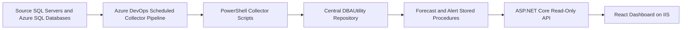
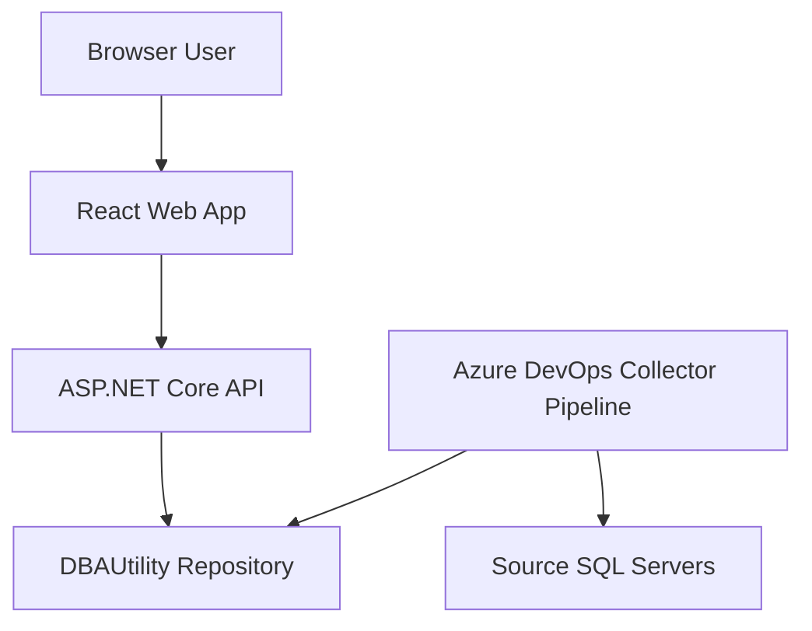

# DBA Capacity Intelligence Dashboard - Customer Lift-And-Shift Wiki

## 1. Purpose

This wiki explains how the DBA Capacity Intelligence Dashboard works, how it is configured, how the pipelines deploy it, and how to lift and shift the project into a customer environment.

The system is designed around a central `DBAUtility` SQL Server repository. Collector scripts gather capacity metrics from monitored SQL Servers and Azure SQL databases, write the data to `DBAUtility`, generate forecast and alert records, and expose the results through an ASP.NET Core API and React dashboard.

This document is intended for:

- DBA automation engineers
- SQL Server DBAs
- Azure DevOps administrators
- IIS administrators
- Customer environment deployment teams
- Operations teams that will support the system after handover

## 2. High-Level Architecture



## 3. Components

| Component | Folder | Purpose |
| --- | --- | --- |
| Repository database | `database/` | Creates `DBAUtility`, history tables, inventory, alerts, forecast procedures, and reporting views. |
| Collector scripts | `collector/` | PowerShell scripts that read active inventory, collect metrics, and insert repository history rows. |
| API | `api/DBA.Capacity.Api/` | ASP.NET Core read-only API that queries `DBAUtility` through Dapper. |
| Web app | `web/dba-capacity-web/` | React Vite dashboard for capacity trends, top growing tables, and alerts. |
| Pipelines | `pipelines/` | Azure DevOps YAML pipelines for database deployment, server onboarding, collection, API deploy, and web deploy. |
| Documentation | `docs/` | Architecture, setup, screenshots, and this lift-and-shift guide. |

## 4. Data Flow

1. `pipelines/collect-capacity.yml` runs manually or on a cron schedule.
2. The collector connects to the `DBAUtility` repository.
3. `Collect-CapacityMetrics.ps1` reads active rows from `dbo.ServerInventory`.
4. Each active server is processed with its configured `server_type`, `connection_mode`, and `credential_key`.
5. Metric scripts collect database size, file size, disk space, table size, backup size, and TempDB usage where supported.
6. Collector scripts call repository insert stored procedures.
7. `Run-Forecast.ps1` executes forecast and alert generation procedures.
8. The API reads from repository views and tables.
9. The React web app calls the API and displays dashboards.

## 5. Security Boundary

The frontend never connects directly to SQL Server.



Important security points:

- SQL credentials are not committed to Git.
- Collector credentials are read from Azure DevOps secret variables.
- Source SQL passwords are not stored in `DBAUtility`.
- The API should use only read access to `DBAUtility`.
- The web app receives dashboard JSON only.
- The current MVP does not enforce user login or role-based authorization.

## 6. Repository Database

The central repository database is named:

```text
DBAUtility
```

It stores:

- Server inventory
- Database size history
- File size history
- Disk space history
- Table size history
- Backup size history
- TempDB usage history
- Forecast results
- Alert history

### Deployment Script Order

The database pipeline runs scripts in this order:

```text
database/001_Create_Database.sql
database/tables/*.sql
database/procedures/*.sql
database/views/*.sql
database/seed/*.sql
```

The table scripts are intended to be idempotent. They create missing objects and include incremental changes such as `credential_key` on `dbo.ServerInventory`.

### Server Inventory

The key inventory table is:

```text
dbo.ServerInventory
```

Important columns:

| Column | Meaning |
| --- | --- |
| `server_name` | SQL Server instance name or Azure SQL logical server name. |
| `environment` | Environment label such as Development, Test, Production, DR. |
| `server_type` | `SQLServer`, `AzureSQL`, or `ManagedInstance`. |
| `connection_mode` | `SqlAuth`, `WindowsAuth`, or `ManagedIdentity`. MVP collector implements `SqlAuth` and `WindowsAuth`. |
| `credential_key` | Logical key used to pick source credentials from `SOURCE_SQL_CREDENTIALS_JSON`. |
| `is_active` | `1` means the collector processes the server. |

Example:

```sql
SELECT
    server_name,
    environment,
    server_type,
    connection_mode,
    credential_key,
    is_active
FROM dbo.ServerInventory
ORDER BY server_name;
```

## 7. Collector Behavior

The collector entry point is:

```text
collector/Collect-CapacityMetrics.ps1
```

It performs these steps:

1. Starts transcript logging under `collector/logs/`.
2. Ensures `dbatools` is installed and imported.
3. Verifies the repository is reachable.
4. Reads active monitored servers from `dbo.ServerInventory`.
5. Sets per-server environment values for child collector scripts.
6. Runs each supported metric collector.
7. Writes collection failures into `dbo.AlertHistory`.
8. Generates forecasts and alerts.
9. Publishes collector logs as a pipeline artifact.

### Collector Scripts

| Script | Purpose | Azure SQL Database support |
| --- | --- | --- |
| `Collect-DatabaseSize.ps1` | Database size by database. | Supported by querying each database. |
| `Collect-FileSize.ps1` | File size and free space by database file. | Supported where permissions allow. |
| `Collect-DiskSpace.ps1` | Instance disk volumes. | Skipped for Azure SQL Database. |
| `Collect-TableSize.ps1` | Table size and row counts. | Supported where permissions allow. |
| `Collect-BackupSize.ps1` | Backup history from `msdb`. | Skipped for Azure SQL Database. |
| `Collect-TempDBUsage.ps1` | TempDB usage. | Skipped for Azure SQL Database. |
| `Run-Forecast.ps1` | Forecast and alert generation. | Repository only. |

### Azure SQL Database Notes

Azure SQL Database does not expose the same instance-level DMVs as SQL Server. For that reason:

- Disk space collection is skipped.
- Backup size collection is skipped.
- TempDB usage collection is skipped.
- Database size and file size are collected per database.
- Table size is collected per database where the login has permission.

## 8. Source Credential Model

Different source servers can use different SQL usernames and passwords.

The inventory row only stores a `credential_key`, for example:

```text
default
azuresql
prod-east
customer-a
```

The actual usernames and passwords are stored in Azure DevOps variable group `configs` as a secret variable named:

```text
SOURCE_SQL_CREDENTIALS_JSON
```

Example:

```json
{"default":{"user":"sa","password":"local-source-password"},"azuresql":{"user":"azure_sql_admin","password":"azure-source-password"}}
```

The collector resolves credentials as follows:

1. Read `ServerInventory.credential_key`.
2. Find that key in `SOURCE_SQL_CREDENTIALS_JSON`.
3. Use the matching `user` or `username` and `password`.
4. If the key is `default` and no JSON entry exists, fall back to `SQL_USER` and `SQL_PASSWORD`.

### Example Inventory Updates

On-premises SQL Server using `sa`:

```sql
UPDATE dbo.ServerInventory
SET server_type = 'SQLServer',
    connection_mode = 'SqlAuth',
    credential_key = 'default',
    updated_at = SYSUTCDATETIME()
WHERE server_name = N'DESKTOP-CIS3NI4';
```

Azure SQL Database using an Azure SQL admin login:

```sql
UPDATE dbo.ServerInventory
SET server_type = 'AzureSQL',
    connection_mode = 'SqlAuth',
    credential_key = 'azuresql',
    updated_at = SYSUTCDATETIME()
WHERE server_name = N'shamvil.database.windows.net';
```

## 9. API

The API project is:

```text
api/DBA.Capacity.Api/DBA.Capacity.Api.csproj
```

The API uses:

- ASP.NET Core
- Dapper
- SQL Server
- Swagger
- CORS
- Central error handling middleware

### API Endpoints

| Endpoint | Purpose |
| --- | --- |
| `GET /` | Redirects to Swagger. |
| `GET /health` | Basic health check. |
| `GET /swagger` | Swagger UI. |
| `GET /api/dashboard/summary` | Dashboard summary cards. |
| `GET /api/capacity/databases` | Database capacity forecast rows. |
| `GET /api/capacity/databases/{serverName}/{databaseName}/trend?days=90` | Trend chart data. |
| `GET /api/capacity/top-growing-tables?limit=20` | Top growing tables. |
| `GET /api/alerts/active` | Active unresolved alerts. |
| `GET /api/servers` | Active server inventory. |

### API Configuration

Local app settings are in:

```text
api/DBA.Capacity.Api/appsettings.json
```

Production pipeline configuration is written to:

```text
appsettings.Production.json
```

Important API variables:

| Variable | Purpose |
| --- | --- |
| `DBA_API_CONNECTION_STRING` | API connection string to `DBAUtility`. |
| `DBA_API_ALLOWED_ORIGINS` | Semicolon-separated CORS origins allowed to call the API. |
| `IIS_API_SITE_NAME` | IIS site name for the API. |
| `IIS_API_APP_POOL` | IIS app pool for the API. |
| `IIS_API_PHYSICAL_PATH` | Physical publish path. |
| `IIS_API_PORT` | API HTTP port. |

Example:

```text
DBA_API_CONNECTION_STRING = Server=.;Database=DBAUtility;Trusted_Connection=True;TrustServerCertificate=True;
DBA_API_ALLOWED_ORIGINS = http://localhost:8080;http://127.0.0.1:8080
IIS_API_PORT = 5088
```

## 10. Web App

The web app project is:

```text
web/dba-capacity-web
```

It uses:

- React
- Vite
- React Router HashRouter
- Recharts
- Lucide icons

### Web Configuration

The key build-time variable is:

```text
VITE_API_BASE_URL
```

Example:

```text
VITE_API_BASE_URL = http://localhost:5088/api
```

This value is compiled into the static web build. If the API URL changes, rebuild and redeploy the web app.

### IIS Routing

The web app uses `HashRouter`. That means URLs look like:

```text
http://localhost:8080/#/
http://localhost:8080/#/alerts
```

This avoids requiring IIS URL Rewrite for client-side routes.

### Time Zone Handling

The UI has a header-level time zone selector.

The repository stores timestamps using UTC values such as `SYSUTCDATETIME()`. SQL Server `DATETIME2` values may be returned by the API without a `Z` suffix, so the web formatter treats repository timestamps as UTC and then formats them into the selected UI time zone.

The time zone preference is stored in browser local storage.

## 11. Azure DevOps Pipelines

Pipeline files:

| Pipeline | File | Purpose |
| --- | --- | --- |
| Deploy Database | `pipelines/deploy-database.yml` | Deploys `DBAUtility` scripts. |
| Onboard Server | `pipelines/onboard-server.yml` | Adds or updates one `dbo.ServerInventory` row. |
| Collect Metrics | `pipelines/collect-capacity.yml` | Runs collector scripts and publishes logs. |
| Deploy API | `pipelines/deploy-api.yml` | Builds API, publishes artifact, deploys to IIS. |
| Deploy Web | `pipelines/deploy-web.yml` | Builds React app, publishes artifact, deploys to IIS. |

### Current Agent Assumptions

The current YAMLs target:

```text
Pool: Shamvil-pool
Agent: shamvil
OS: Windows_NT
```

Customer environments must update the `pool` and `demands` blocks if the pool or agent name changes.

Example:

```yaml
pool:
  name: Customer-DBA-Pool
  demands:
    - Agent.Name -equals customer-dba-agent-01
    - Agent.OS -equals Windows_NT
```

### Project Root Assumption

The YAMLs currently assume the project is checked out under:

```text
$(Build.SourcesDirectory)\dba-capacity-intelligence-dashboard
```

That is controlled by:

```yaml
variables:
  - name: projectRoot
    value: dba-capacity-intelligence-dashboard
```

If the customer repository places the project files at the repository root, change:

```yaml
value: dba-capacity-intelligence-dashboard
```

to:

```yaml
value: .
```

### Scheduled Collector

The collector has a YAML cron schedule:

```yaml
schedules:
  - cron: "*/10 * * * *"
    displayName: Run every 10 minutes
    branches:
      include:
        - master
        - main
    always: true
```

Azure DevOps cron values are UTC.

For customer environments, review whether every 10 minutes is appropriate. A 10-minute schedule is around 1008 runs per week, which is close to common service limits. A safer production default may be:

```yaml
cron: "*/15 * * * *"
```

## 12. Azure DevOps Variable Group

All YAMLs import a variable group named:

```text
configs
```

Create this group in Azure DevOps:

```text
Pipelines -> Library -> Variable groups -> New variable group
```

### Required Variables

| Variable | Secret | Example | Purpose |
| --- | --- | --- | --- |
| `DBA_REPOSITORY_SERVER` | No | `.` or `sqlrepo01` | SQL Server hosting `DBAUtility`. |
| `DBA_REPOSITORY_DB` | No | `DBAUtility` | Repository database name. |
| `DBA_SQL_AUTH_MODE` | No | `WindowsAuth` or `SqlAuth` | Repository connection mode for pipelines. |
| `SQL_USER` | Yes | `collector_login` | Repository SQL login or fallback source login. |
| `SQL_PASSWORD` | Yes | `********` | Password for `SQL_USER`. |
| `SOURCE_SQL_CREDENTIALS_JSON` | Yes | JSON map | Source SQL credential map. |
| `VITE_API_BASE_URL` | No | `http://localhost:5088/api` | API URL compiled into web app. |
| `IIS_API_SITE_NAME` | No | `DBA Capacity API` | API IIS site name. |
| `IIS_API_APP_POOL` | No | `DBACapacityApi` | API app pool. |
| `IIS_API_PHYSICAL_PATH` | No | `C:\inetpub\dba-capacity-api` | API deploy path. |
| `IIS_API_PORT` | No | `5088` | API port. |
| `IIS_WEB_SITE_NAME` | No | `DBA Capacity Dashboard` | Web IIS site name. |
| `IIS_WEB_APP_POOL` | No | `DBACapacityWeb` | Web app pool. |
| `IIS_WEB_PHYSICAL_PATH` | No | `C:\inetpub\dba-capacity-web` | Web deploy path. |
| `IIS_WEB_PORT` | No | `8080` | Web port. |
| `DBA_API_CONNECTION_STRING` | Yes | SQL connection string | API connection to `DBAUtility`. |
| `DBA_API_ALLOWED_ORIGINS` | No | `http://localhost:8080` | API CORS origin list. |

### Repository Authentication Options

Windows authentication:

```text
DBA_REPOSITORY_SERVER = .
DBA_REPOSITORY_DB = DBAUtility
DBA_SQL_AUTH_MODE = WindowsAuth
```

SQL authentication:

```text
DBA_REPOSITORY_SERVER = customer-sqlrepo-01
DBA_REPOSITORY_DB = DBAUtility
DBA_SQL_AUTH_MODE = SqlAuth
SQL_USER = dba_capacity_repo_user
SQL_PASSWORD = ********
```

For local SQL Server on the same machine as the agent, prefer `.` over `localhost` when using Windows authentication from a service account.

## 13. IIS Deployment

### Default API Site

```text
Site: DBA Capacity API
App pool: DBACapacityApi
Path: C:\inetpub\dba-capacity-api
URL: http://localhost:5088
```

### Default Web Site

```text
Site: DBA Capacity Dashboard
App pool: DBACapacityWeb
Path: C:\inetpub\dba-capacity-web
URL: http://localhost:8080
```

### Agent Permission Requirement

The deploy pipelines create or update IIS sites and app pools. The Azure DevOps agent service must run as a local administrator.

Check the service account:

```powershell
Get-CimInstance Win32_Service |
  Where-Object { $_.Name -like 'vstsagent*' } |
  Select-Object Name, StartName, State
```

If the service runs as `NT AUTHORITY\NETWORK SERVICE`, IIS deployment will fail with:

```text
IIS deployment requires the Azure DevOps agent process to run as local Administrator.
```

Recommended customer setup:

1. Create a dedicated local account, for example `.\azdoagent`.
2. Add it to the local Administrators group.
3. Run the Azure DevOps agent service as that account.
4. Restart the agent service.

## 14. Permissions

### Repository Database Deployment User

For initial deployment, the database deployment identity needs enough permission to:

- Create database `DBAUtility`
- Create tables, stored procedures, and views
- Alter existing repository objects

For MVP deployment, `sysadmin` or a controlled deployment admin account is simplest. For hardened customer environments, use a dedicated deployment login with only the required database creation and schema permissions.

### Collector Repository User

The collector needs to:

- Read `dbo.ServerInventory`
- Execute repository insert procedures
- Execute forecast and alert procedures
- Insert collection failure alerts

For MVP deployment, the same repository credential can be used for database deployment and collection. For production, create separate deployment and collection identities.

### API Repository User

The API is read-only.

The deploy API pipeline can grant:

```text
IIS APPPOOL\DBACapacityApi -> db_datareader on DBAUtility
```

Alternative: provide a SQL connection string in `DBA_API_CONNECTION_STRING` that uses a read-only SQL login.

### Source SQL User

Source permissions depend on metric coverage:

| Metric | Typical source permission need |
| --- | --- |
| Database size | Metadata visibility on databases and files. |
| File size | Metadata visibility in each database. |
| Disk space | Instance-level metadata and `sys.dm_os_volume_stats`. |
| Table size | Metadata visibility in each user database. |
| Backup size | Read access to backup metadata in `msdb`. |
| TempDB usage | TempDB metadata visibility. |

Start with a read-only SQL login and test. Add additional permissions only where a collector failure proves they are required.

For Azure SQL Database:

- Allow the Azure DevOps agent machine through the Azure SQL firewall.
- Use a SQL login that can connect to `master` and the monitored user databases.
- Do not use `sa`; Azure SQL Database does not support the SQL Server `sa` account.

## 15. Customer Lift-And-Shift Runbook

### Phase 0 - Discovery

Collect these details from the customer:

- Azure DevOps organization and project
- Repository name and default branch
- Self-hosted agent machine name
- Agent pool name and desired agent name
- IIS host name
- SQL Server repository host
- Repository authentication method
- Web URL and API URL
- Ports or hostnames to use
- Source SQL Server inventory
- Source credential strategy
- Azure SQL firewall requirements
- Required collection interval
- Retention requirements
- Security requirements for API and dashboard access

### Phase 1 - Prepare Customer Infrastructure

On the target Windows server:

1. Install IIS.
2. Install IIS Management Scripts and Tools.
3. Install ASP.NET Core Hosting Bundle.
4. Install or allow pipeline installation of .NET SDK 9.
5. Install or allow pipeline installation of Node.js 22.
6. Confirm outbound access to Azure DevOps.
7. Confirm network access to the repository SQL Server.
8. Confirm network access to all source SQL Servers.
9. Open required local ports, for example `5088` and `8080`.

### Phase 2 - Install Self-Hosted Azure DevOps Agent

Install the Azure DevOps agent on the customer IIS or automation host.

Recommended path:

```text
C:\agent
```

Run the agent as a Windows service using a dedicated local administrator account:

```text
.\azdoagent
```

Verify:

```powershell
Get-CimInstance Win32_Service |
  Where-Object { $_.Name -like 'vstsagent*' } |
  Select-Object Name, StartName, State
```

### Phase 3 - Import Repository

Options:

1. Import the Git repository into the customer Azure DevOps project.
2. Push the current repository into a customer-owned repo.
3. Keep the project in a shared repo but create customer-specific branches and pipeline variables.

Recommended for customer ownership:

```powershell
git remote add customer https://dev.azure.com/<customer>/<project>/_git/<repo>
git push customer master
```

### Phase 4 - Adjust Pipeline Pool And Project Root

Update each YAML under `pipelines/`:

- `deploy-database.yml`
- `onboard-server.yml`
- `collect-capacity.yml`
- `deploy-api.yml`
- `deploy-web.yml`

Change the pool:

```yaml
pool:
  name: <customer-agent-pool>
  demands:
    - Agent.Name -equals <customer-agent-name>
    - Agent.OS -equals Windows_NT
```

If the project files are at repo root, set:

```yaml
- name: projectRoot
  value: .
```

### Phase 5 - Create Variable Group

Create Azure DevOps variable group:

```text
configs
```

Populate all variables listed in section 12.

Mark these variables secret:

- `SQL_USER`
- `SQL_PASSWORD`
- `SOURCE_SQL_CREDENTIALS_JSON`
- `DBA_API_CONNECTION_STRING`

Example source credential JSON:

```json
{"default":{"user":"source_readonly","password":"source-password"},"azuresql":{"user":"azure_admin","password":"azure-password"},"prod":{"user":"prod_readonly","password":"prod-password"}}
```

### Phase 6 - Create Pipelines In Azure DevOps

Create one pipeline per YAML:

| Pipeline name | YAML path |
| --- | --- |
| `DBA Capacity - Deploy Database` | `pipelines/deploy-database.yml` |
| `DBA Capacity - Onboard Server` | `pipelines/onboard-server.yml` |
| `DBA Capacity - Collect Metrics` | `pipelines/collect-capacity.yml` |
| `DBA Capacity - Deploy API` | `pipelines/deploy-api.yml` |
| `DBA Capacity - Deploy Web` | `pipelines/deploy-web.yml` |

Make sure each pipeline uses the customer repository branch that contains the current YAML.

### Phase 7 - Deploy Database

Run:

```text
DBA Capacity - Deploy Database
```

Validate in SQL Server:

```sql
SELECT name
FROM sys.databases
WHERE name = N'DBAUtility';

USE DBAUtility;

SELECT TABLE_SCHEMA, TABLE_NAME
FROM INFORMATION_SCHEMA.TABLES
ORDER BY TABLE_SCHEMA, TABLE_NAME;
```

Validate `credential_key` exists:

```sql
SELECT COL_LENGTH(N'dbo.ServerInventory', N'credential_key') AS credential_key_column_id;
```

### Phase 8 - Onboard Source Servers

Run:

```text
DBA Capacity - Onboard Server
```

Use queue-time parameters.

On-prem SQL Server example:

```text
serverName = prod-sql-01
environment = Production
serverType = SQLServer
connectionMode = SqlAuth
credentialKey = prod
isActive = true
```

Azure SQL example:

```text
serverName = customer-sql.database.windows.net
environment = Production
serverType = AzureSQL
connectionMode = SqlAuth
credentialKey = azuresql
isActive = true
```

Validate:

```sql
SELECT server_name, environment, server_type, connection_mode, credential_key, is_active
FROM DBAUtility.dbo.ServerInventory
ORDER BY server_name;
```

### Phase 9 - Run First Collection

Run:

```text
DBA Capacity - Collect Metrics
```

Expected log pattern:

```text
Starting collection for prod-sql-01 (SQLServer, SqlAuth, credential key: prod)...
Starting collection for customer-sql.database.windows.net (AzureSQL, SqlAuth, credential key: azuresql)...
Skipping DiskSpace for customer-sql.database.windows.net because server_type 'AzureSQL' is not supported by that collector.
```

Validate repository rows:

```sql
SELECT TOP (20) *
FROM DBAUtility.dbo.DatabaseSizeHistory
ORDER BY collection_time DESC;

SELECT TOP (20) *
FROM DBAUtility.dbo.AlertHistory
ORDER BY alert_time DESC;
```

### Phase 10 - Deploy API

Run:

```text
DBA Capacity - Deploy API
```

Validate:

```text
http://<iis-host>:<api-port>/health
http://<iis-host>:<api-port>/swagger
http://<iis-host>:<api-port>/api/dashboard/summary
```

For local default values:

```text
http://localhost:5088/health
http://localhost:5088/swagger
http://localhost:5088/api/dashboard/summary
```

### Phase 11 - Deploy Web

Set `VITE_API_BASE_URL` before build:

```text
VITE_API_BASE_URL = http://<iis-host>:<api-port>/api
```

Run:

```text
DBA Capacity - Deploy Web
```

Validate:

```text
http://<iis-host>:<web-port>/
```

For local default values:

```text
http://localhost:8080/
```

### Phase 12 - Enable Scheduled Collection

Check scheduled runs in Azure DevOps:

```text
Pipeline -> ... -> Scheduled runs
```

If UI schedules exist, remove them so YAML schedules apply.

Confirm the branch filter includes the active branch:

```yaml
branches:
  include:
    - master
    - main
```

### Phase 13 - Handover

Provide the customer:

- Web dashboard URL
- API health URL
- Azure DevOps pipeline names
- Variable group name
- Agent service account name
- Repository SQL Server name
- List of onboarded servers
- Credential key map without passwords
- Troubleshooting runbook
- Known MVP limitations

## 16. Validation Checklist

### Database

- `DBAUtility` exists.
- Tables, procedures, and views exist.
- `dbo.ServerInventory` contains active rows.
- `credential_key` exists.

### Collector

- Pipeline can connect to repository.
- Pipeline can connect to each active source.
- Logs are published as `collector-logs`.
- Forecast procedure completes.
- Alerts procedure completes.

### API

- IIS site exists.
- App pool exists and is running.
- `/health` returns healthy.
- `/swagger` loads.
- `/api/dashboard/summary` returns JSON.
- API can read `DBAUtility`.

### Web

- IIS site exists.
- Static files exist in web physical path.
- Dashboard loads.
- API calls succeed from browser.
- Time zone selector changes displayed times.
- Alerts page filters and table layout render correctly.

## 17. Troubleshooting

### IIS deployment requires local Administrator

Symptom:

```text
IIS deployment requires the Azure DevOps agent process to run as local Administrator.
```

Cause:

The Azure DevOps agent service account is not a local administrator.

Fix:

Run the agent service as a dedicated local administrator account.

### API returns database unavailable

Symptoms:

```text
Database temporarily unavailable.
```

Common causes:

- API app pool identity cannot read `DBAUtility`.
- `DBA_API_CONNECTION_STRING` is wrong.
- SQL Server is not reachable from IIS host.

Fix:

Grant read access:

```sql
USE [master];
CREATE LOGIN [IIS APPPOOL\DBACapacityApi] FROM WINDOWS;

USE [DBAUtility];
CREATE USER [IIS APPPOOL\DBACapacityApi] FOR LOGIN [IIS APPPOOL\DBACapacityApi];
ALTER ROLE db_datareader ADD MEMBER [IIS APPPOOL\DBACapacityApi];
```

### Web page loads but API calls fail

Common causes:

- `VITE_API_BASE_URL` was wrong at build time.
- API CORS does not include the web origin.
- API site is not running.

Fix:

1. Correct `VITE_API_BASE_URL`.
2. Correct `DBA_API_ALLOWED_ORIGINS`.
3. Redeploy API.
4. Rebuild and redeploy web.

### Collector uses `sa` for Azure SQL

Cause:

The Azure SQL inventory row has `credential_key = default` or `NULL`, or the old collector code is deployed.

Fix:

```sql
UPDATE dbo.ServerInventory
SET server_type = 'AzureSQL',
    connection_mode = 'SqlAuth',
    credential_key = 'azuresql',
    updated_at = SYSUTCDATETIME()
WHERE server_name = N'<server>.database.windows.net';
```

Then rerun collection.

### ActiveDirectoryIntegrated authentication error

Symptom:

```text
Failed to authenticate the user NT Authority\Anonymous Logon in Active Directory
```

Common causes:

- Inventory row is not `connection_mode = 'SqlAuth'`.
- Old collector code is running.
- A connection string or dbatools path is forcing Active Directory integrated authentication.

Fix:

1. Confirm `connection_mode = 'SqlAuth'`.
2. Confirm collector log prints `credential key: <key>`.
3. Push latest collector changes.
4. Rerun collection.

### Invalid column name `credential_key`

Cause:

The repository database has not been upgraded.

Fix:

Run `DBA Capacity - Deploy Database`, or run:

```sql
USE DBAUtility;
GO

IF COL_LENGTH(N'dbo.ServerInventory', N'credential_key') IS NULL
BEGIN
    ALTER TABLE dbo.ServerInventory
        ADD credential_key VARCHAR(100) NULL;
END;
GO
```

### Chart shows UTC instead of selected time zone

Cause:

Older web code parsed SQL `DATETIME2` strings as browser-local time instead of UTC.

Fix:

Deploy the web build that includes `parseRepositoryDateTime` in `formatters.js`.

### Scheduled collector does not trigger

Common causes:

- Branch filter does not include the active branch.
- UI schedules override YAML schedules.
- Pipeline YAML has not been pushed.
- Agent is offline.

Fix:

1. Confirm YAML includes the active branch.
2. Remove UI schedules.
3. Push a YAML change.
4. Check `Pipeline -> Scheduled runs`.
5. Confirm agent is online.

### Azure SQL database timeout

Symptoms:

```text
Connection Timeout Expired
pre-login handshake
```

Common causes:

- Azure SQL firewall does not allow the agent host.
- Serverless Azure SQL database is paused or warming up.
- Network path is slow or blocked.
- Specific database is unavailable.

Fix:

1. Test SSMS or Azure Data Studio from the agent machine.
2. Allow the agent public IP in Azure SQL firewall.
3. Retry after the database is online.
4. Increase timeout only after network and firewall are verified.

## 18. Backup, Rollback, And Recovery

### Before Customer Deployment

Back up:

- Existing `DBAUtility` database if present.
- IIS site configuration if replacing existing sites.
- Current web and API physical directories.
- Azure DevOps variable group values.

### Rollback API

1. Stop API site.
2. Restore previous API physical folder.
3. Start API site.
4. Validate `/health`.

### Rollback Web

1. Stop web site.
2. Restore previous web physical folder.
3. Start web site.
4. Validate dashboard URL.

### Rollback Database

Preferred:

- Restore a SQL Server database backup.

Alternative for minor schema changes:

- Apply a tested rollback script.

Do not drop history tables unless the customer confirms data loss is acceptable.

## 19. Production Hardening Recommendations

Before using this as a production customer service, review these items:

- Add Entra ID or Windows authentication to the API and frontend.
- Add role-based authorization.
- Move secrets to Azure Key Vault or customer-approved vault.
- Use dedicated SQL logins or domain service accounts for each responsibility.
- Split deployment, collector, and API identities.
- Add data retention and purge jobs for history tables.
- Add API and collector monitoring.
- Add TLS bindings in IIS.
- Add customer DNS names.
- Add backup jobs for `DBAUtility`.
- Add disaster recovery documentation.
- Add test projects for API and collector logic.
- Define support SLAs and alert routing.

## 20. Customer Environment Worksheet

Use this worksheet during lift-and-shift planning.

| Item | Customer value |
| --- | --- |
| Azure DevOps organization | |
| Azure DevOps project | |
| Git repository | |
| Default branch | |
| Agent pool | |
| Agent name | |
| Agent machine | |
| Agent service account | |
| Repository SQL Server | |
| Repository database | `DBAUtility` |
| Repository auth mode | |
| API host | |
| API port | |
| API URL | |
| Web host | |
| Web port | |
| Web URL | |
| Collection interval | |
| Source credential keys | |
| Azure SQL firewall owner | |
| IIS administrator | |
| SQL Server DBA owner | |
| Azure DevOps owner | |
| Support owner | |

## 21. Standard Customer Deployment Order

Use this final condensed sequence after the environment is prepared:

1. Import repository.
2. Update pipeline pool, agent demand, and `projectRoot`.
3. Create `configs` variable group.
4. Install and verify self-hosted agent.
5. Run `DBA Capacity - Deploy Database`.
6. Run `DBA Capacity - Onboard Server` for each source.
7. Run `DBA Capacity - Collect Metrics`.
8. Validate repository history rows and alerts.
9. Run `DBA Capacity - Deploy API`.
10. Validate API health and Swagger.
11. Run `DBA Capacity - Deploy Web`.
12. Validate dashboard, alerts, filters, and time zone selector.
13. Confirm scheduled collector runs.
14. Hand over URLs, runbooks, and ownership matrix.

## 22. Quick Reference URLs

Default local API:

```text
http://localhost:5088
http://localhost:5088/health
http://localhost:5088/swagger
```

Default local web:

```text
http://localhost:8080
```

Local Vite development:

```text
http://localhost:5173
```

## 23. Quick Reference Commands

Build API:

```powershell
dotnet build .\api\DBA.Capacity.Api\DBA.Capacity.Api.csproj
```

Build web:

```powershell
cd .\web\dba-capacity-web
npm ci
npm run build
```

Run collector locally:

```powershell
$env:DBA_REPOSITORY_SERVER = "."
$env:DBA_REPOSITORY_DB = "DBAUtility"
$env:DBA_SQL_AUTH_MODE = "WindowsAuth"
.\collector\Collect-CapacityMetrics.ps1
```

Check IIS agent service:

```powershell
Get-CimInstance Win32_Service |
  Where-Object { $_.Name -like 'vstsagent*' } |
  Select-Object Name, StartName, State
```

Check active inventory:

```sql
SELECT server_name, environment, server_type, connection_mode, credential_key, is_active
FROM DBAUtility.dbo.ServerInventory
ORDER BY server_name;
```

